# The Association between Audio Features, Popularity, and Listeners’ Preferences
###### Author: Avianna Bui 
###### Methods: Predictive Analytics with Random Forest, LASSO, and GAM; Cluster Analysis with K-Means Clustering; Correlation Analysis

## Introduction
What aspect do hit songs share? With the increasing globalization of the US music industry and the rise of experimental music, it becomes more challenging to determine what features distinguish hits from less popular songs. As music continues to play an integral role in our lives, whether for recreational purposes or as a mechanism for emotional outlets, it is crucial to understand the musical mechanisms that affect their popularity. By examining the factors that influence the success of a song over time, we can gain a deeper insight into music preferences and listeners' behavior in the United States.

## Research Question
To explore the relationship between audio features and popularity, my supervised learning analysis examines the audio features that are the strongest predictors of Spotify Track Popularity by fitting a LASSO, GAM, and a random forest model. I also apply K-means Clustering to investigate if there exist any trends in the dataset across decades and audio features. These analyses allow me to gain a deeper insight into changing music preferences or composition trends in the US music industry over time. 

## Data Context
The dataset, shared on https://data.world/ by Sean Miller, comprises all singles on Billboard Hot 100’s weekly chart from 1958 to 2021, along with their audio features and Spotify Popularity ranking from the Spotify Web API. As the US music industry standard chart, Billboard’s ranking is a trusted measure of a song’s popularity and an artist's success. Meanwhile, the Spotify data provides audio properties of songs for developers to conduct in-depth audio analysis. Each case in the dataset represents a weekly Hot 100 song and its corresponding position on the chart, along with its Spotify’s audio features (danceability, energy, etc.) and popularity ranking. This Spotify’s popularity score, which is the response variable for the supervised learning analysis, is based on total streams, the number of recent plays as well as the frequency of plays. 

To improve the interpretability of the analysis, only unique cases based on a song’s name, artist(s), and the year they appear on Billboard’s chart are retained. 

Additional information on the data set, as well as the descriptions of the audio features, can be found at https://github.com/rfordatascience/tidytuesday/blob/master/data/2021/2021-09-14/readme.md 

## Summary of Findings
The analysis suggests that the most important predictor for track popularity is loudness. More specifically, songs with a loudness score above -10 dB frequently rank high in their Spotify Popularity score. Other notable audio features include acousticness, valence, danceability, speechiness, and track duration. Popular songs tend to have a balanced mix of music and lyrics, as well as lower acousticness and positiveness. My best prediction model for song popularity based on audio features explains 56% of the variation in the outcome, with an average absolute magnitude between the actual values and the predicted values of 14.8 points. 

Compared to 2010s songs, clusters of songs charting in the 2000s have a relatively identical loudness range, but possess less diverse acousticness and less emotional ambiguity. This increasing variety in popular music might be partially accounted for by an increasing listeners’ preference for experimental sounds and mixed genres. 

## Part I. Supervised Learning: Predict Spotify Track Popularity from Audio Features

### Correlation Matrix
I first examine the Spotify audio features’ pairwise correlation to identify any potential issue with collinearity. The visualization below indicates that only a few pairs of variables demonstrate weak to moderate correlation, among which loudness and energy have the strongest positive relationship with a correlation coefficient of 0.68. This correlation is understandable in our data context since the energy variable is impacted by a song’s dynamic range, which is the calculated difference between the quietest and loudest volume of a song. In addition, energy and acousticness are moderately anti-correlated (R = -0.59). Nonetheless, since these are only moderately correlated at best and the majority of audio features have no meaningful linear correlation with correlation coefficients close to 0, I lean toward the hypothesis that there is not a substantial problem with multicollinearity that would result in overfitting. 

  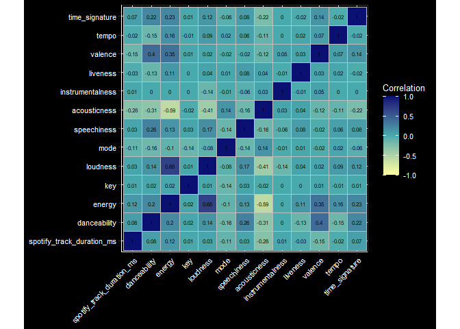

### Least Absolute Shrinkage and Selection Operator (LASSO)
To select only important audio features for my parametric model, I apply the Least Absolute Shrinkage and Selection Operator (LASSO) method to improve the predictive accuracy as well as interpretability of the built model. I evaluate the model performance for each penalized term using ten-fold cross-validation and then select the optimal tuning parameter according to the One Standard Error rule. This is to make sure the most parsimonious LASSO model is chosen whose predictive ability is still roughly similar to the model with the lowest test error estimate. 

Based on the 10-fold cross-validation result, our best model has a mean absolute error (MAE) of 15.83 at a penalty term of 0.2572. This means that on average, the model is off in its popularity rating predictions by 15.83 points. The standard error for the MAE is 0.06, which is not a significant error since our MAE estimate is only off the true MAE in the population by as much as 0.12 points. Our LASSO calculation also removes the key of a song from the list of included variables in the fitted model. 

### Generalized Additive Model (GAM)
To determine which parametric model should be used to fit the predictive model, I examine the residual plots of the final LASSO model for residuals versus fitted values, and residuals versus predictors. 

  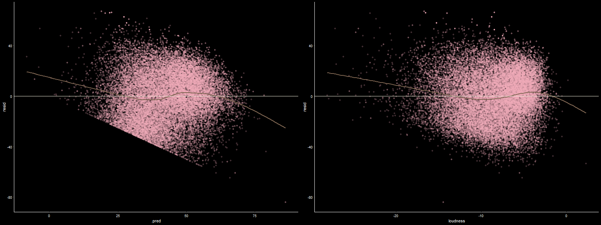

Based on the residual plots above, there exists a nonlinear relationship between certain predictors and the response variables. As a result, a GAM model is selected to handle this nonlinearity while still ensuring the interpretability of the model. Using the variables selected from LASSO (that is, all audio features except for key), I specify the transformations of variables as natural cubic spline relationships, then use 10-fold cross-validation to evaluate the fitted GAM. The final model with the optimal degree of freedom is chosen using the “one standard error” rule.

The best GAM occurs at an adjusted degree of freedom of 4 with an MAE of 15.61. This demonstrates a marginal improvement compared to the performance of the LASSO model: the average error of the GAM's predictions in comparison with the actual popularity rating is 15.61 points. The standard error for the MAE is also 0.06, which is relatively insignificant. 

### Random Forest Model
I decide to fit a nonparametric model alongside a parametric one to examine the predictive power of different approaches. A random forest model is chosen due to its flexibility and efficiency in working with large-scale datasets. Due to computational time constraints, I only managed to build one rather than multiple random forest regression models. A total of 500 trees are built in the forest, with 3 random variables chosen out of 13 original variables at each split. In the end, out-of-bag (OOB) error estimation is applied to evaluate the random forest performance. 

The mean squared error (MSE) for the OOB prediction error is 219.32, meaning that the MAE of the model is approximately 14.80. This suggests that the average absolute magnitude between the actual values and the predicted values is 14.8 points. The R-squared estimate for this model is 0.56, so 56% of the variability in the outcome variable can be explained by the model. This suggests a moderate predictive power, which is understandable since there might be multiple factors other than audio features that influence the popularity of a song e.g. artist’s popularity, trendy choreography, etc.

### Evaluate Model Performance
Based on the error estimate, the random forest model has the most accurate prediction out of our three models, followed by GAM and finally LASSO. Nonetheless, there is not much difference in terms of the predictive ability of our three models. 

  

According to the above boxplot, the median values of Spotify Popularity score across years range from around 20 in the 50s and 60s, to around 60 to 75 in recent decades. Within this context, an MAE of approximately 15 points is only moderate in terms of predictive power. As mentioned before, other factors than audio features might account for track popularity, so this result is hardly surprising. 

### Variable Importance

  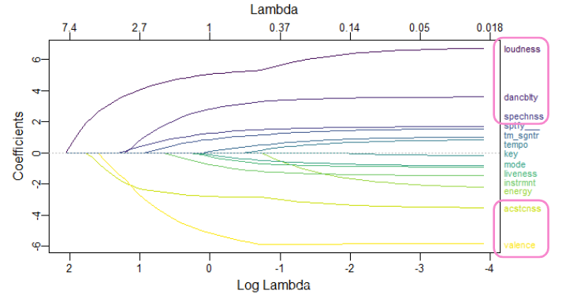

Looking at the visualization of the coefficient path of our LASSO model, the six most important audio features in determining the Spotify Track Popularity of a song are, in descending order: loudness, acousticness, valence, speechiness, danceability, and track duration. 

  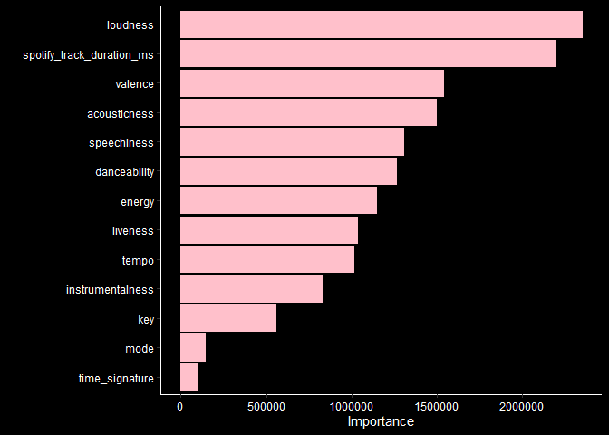

Meanwhile, for our random forest regression model, the most important variables are respectively: loudness, track duration, valence, acousticness, speechiness, and danceability. In other words, our LASSO and random forest model share the same important variables but differ in their ranking. Among the most important variables, loudness is recognized as having the greatest significance in predicting Spotify Track Popularity in both models. Valence is also a relatively important predictor, ranking third in both algorithms. Interestingly, while LASSO  removes key from its fitted model, the key of a song is the third weakest predictor according to the random forest algorithm. In turn, it rates time signature as the least important predictor. 

  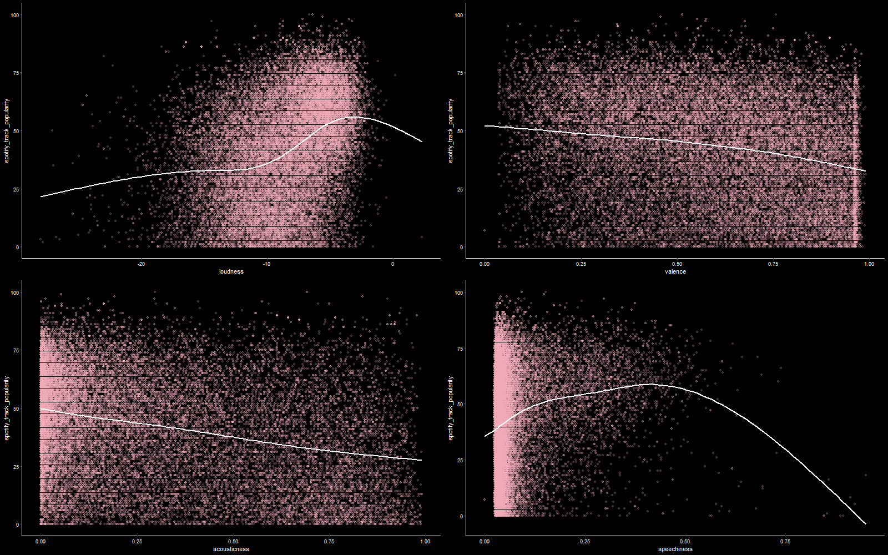

To explore the relationships between several important variables and Spotify Track Popularity, I create scatterplots of these predictors versus the outcome using Locally Estimated Scatterplot Smoothing (LOESS). The scatterplot for loudness suggests that there is a positive correlation between loudness and popularity, with songs having a loudness indicator from -10 to 0 being substantially more popular. The opposite is true for acousticness: songs with a higher level of acousticity tend to be less popular. Interestingly, the same pattern appears in the valence predictor, meaning that more happy-sounding songs have a lower possibility of being popular. Meanwhile, speechiness has a nonlinear pattern with most popular songs having a speechiness indicator in the middle range. This suggests that the audience prefers songs that have a balanced mix between instrumental music and lyrics. 

## Part II. Unsupervised Learning: Identify Song Clusters across Decades among Important Audio Features

### K-Means Clustering 
To examine trends in groups of audio features across decades, I compare the result of K-means clustering on songs in two decades: the 2000s and the 2010s. The audio features selected for this task are loudness, acousticness, and valence, which are among the most important audio features based on LASSO and random forest outcomes. These variables are scaled to have similar standard deviations. 

I perform K-means clustering with 6 clusters for each decade. This number is derived from the examination of the “Number of clusters versus Total Within-cluster Sum of Squares” plot: as seen in the below figures, six clusters ensure a high enough number of clusters for a low within-cluster total sum of squares while still allowing for easier interpretation. 

  

When we plot the song clusters in the 2000s and 2010s based on their loudness and acousticity, we can observe that the two decades have a relatively similar loudness range, with the majority of songs having a loudness score from around -13 to -3. Song clusters in the 2010s seem to have more variability in their acousticness, since the 2010s have 2 song clusters with above-average acousticity (which is separated by an approximate -10 loudness threshold). In contrast, four out of five clusters in the 2000s have below-average acousticness. 

  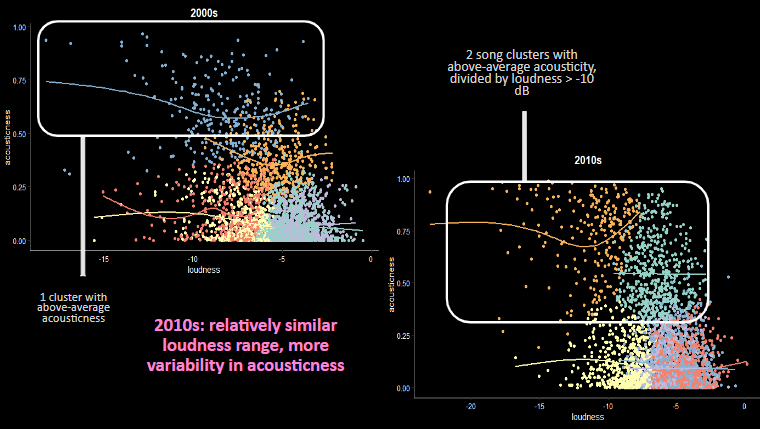

Meanwhile, when we explore the valence against the loudness of song clusters in the 2000s versus the 2010s, it can be seen that 2000s songs contain more distinguished musical positiveness. In other words, song clusters in the 2000s are clearer in terms of the emotions they convey with either a below or above-average positivity score, regardless of their loudness ranking. On the other hand, song clusters in the 2010s on the higher range of loudness have more variance in their valence score in either the high, middle, or low valence range. 

  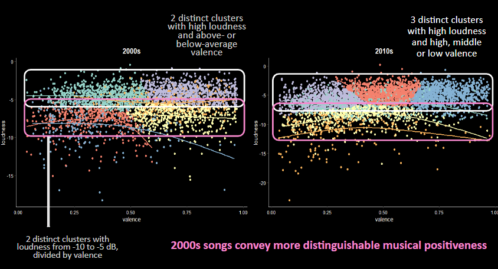

The cluster graphs between acousticness and valence in the two decades demonstrate that in the 2000s, song clusters with higher acousticness scores have lower valence. Meanwhile, song clusters in the 2010s with greater acousticity mix both high and low-valence songs. This might suggest an increase in diversity in terms of 2010s music or musical taste: whereas popular acoustic 2000s songs mainly convey somber or negative emotions, acoustic songs in the 2010s seem to express a wider variety of feelings.

  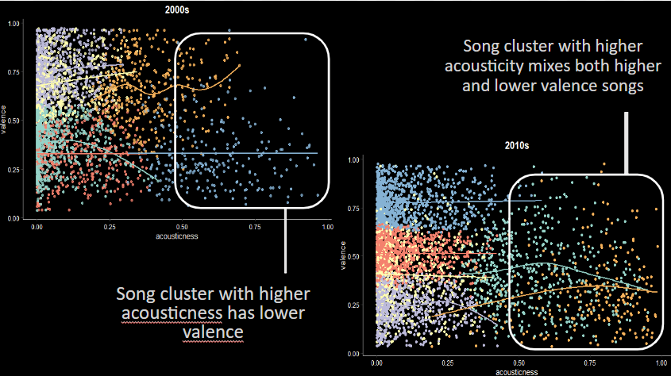

### Examples from Artists
Can we observe the aforementioned trends in the music of popular artists? To explore that question, I visualize and cross-compare the audio features in the music of three famous artists: Taylor Swift, Beyonce, and Coldplay. These artists were selected because they follow different music styles and genres while having multiple hit songs in both the 2000s and the 2010s, which allows me to observe how their music changes across decades. 

In terms of loudness, we only see an increasing trend in the 2010s in Coldplay’s music. Meanwhile, Beyonce’s music greatly fluctuates regarding its loudness degree, whereas Taylor’s songs have witnessed a gradual decrease in their loudness values. Nonetheless, the majority of these songs have a loudness above -10 dB. As previously mentioned in the Supervised Learning section, songs having a loudness indicator in this range tends to be more popular. The trends in the loudness score of these songs, therefore, are unlikely to be greatly significant in terms of their impact on song popularity. 

  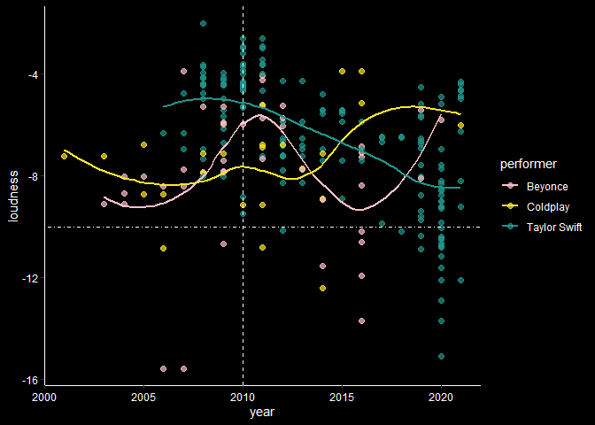

Regarding acousticity, there is a notable increase in Beyonce’s and Taylor Swift’s song acousticness levels in the 2010s, especially in the latter’s songs. As seen in the graph, there are more songs with above-average acousticness scores in the 2010s compared to the 2000s. While this might partially due to the higher number of hit songs in the 2010s, this decade also witnessed a wider variation in acousticness, with the highest score approaching 1.0 compared to the highest 0.7 in the 2000s. 

  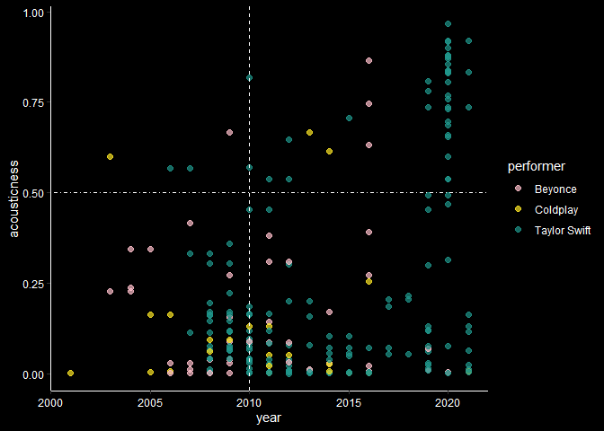

The three artists differ significantly in terms of musical positiveness. Coldplay’s music demonstrates a trend toward affective ambiguity with a musical positiveness score approaching 0.5 in the 2010s, compared to their more somber tones in the prior decade. The opposite is true for Beyonce, whose music turns to convey a more ‘negative’ sentiment in the later decade. Meanwhile, Taylor Swift’s song collection signifies a wide range of emotions, from highly pessimistic to extremely joyful, so there is no notable trend in terms of her valence. 

  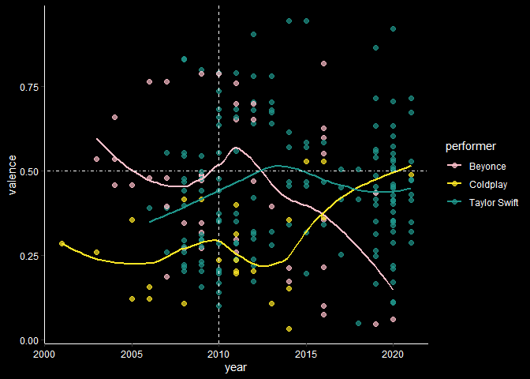

### Music trend analysis
The increasing diversity of acousticity in 2010s music and the greater ambivalence expressed in these songs might be a result of the diversification of genres in contemporary music. Many songs nowadays mix components from multiple genres (think Dance Monkey by Tones and I, which combines R&B, soul, disco, indie, and electropop elements), and this heterogeneity results in songs that can be described as both upbeat and ballad-y. In addition, modern sound technology, downloadable music creation studio softwares such as GarageBand, and streaming platforms like SoundCloud have all contributed to the rise of experimental music. As a result, contemporary pop music is much more diverse-sounding. 

Meanwhile, it is not surprising that the majority of popular music in recent decades has a relatively identical loudness range of around -13 to -3. By the late 2010s, most major U.S. streaming platforms apply loudness normalization by default, with Spotify, Soundcloud, and Youtube having a preferred loudness of around -14 LUFS (“Loudness war”). In fact, Spotify’s website recommends artists to “target the loudness level of your master at -14dB integrated LUFS and keep it below -1dB TP (True Peak) max” (“Loudness Normalization”) to prevent sound distortion in the normalization process. Keeping a song’s loudness within that range ensures that the audience can enjoy the best possible sound quality. 

## Limitations & Future Implementation
Because there are songs that appear on the Billboard chart for multiple years, these songs are duplicated in the data set which might have affected the machine learning algorithm results. In addition, since Spotify Track Popularity is impacted by recent number of plays and play frequency, songs that are released more recently would have an advantage in their popularity ranking compared to songs from the 1900s. To address this, it might be beneficial to predict song popularity based on a song’s Billboard chart position and weeks on charts in addition to its Spotify Popularity score. It would also be interesting to perform clustering analysis on songs across multiple decades and indicators. 

## Appendix

"Loudness War." Wikipedia, Wikimedia Foundation, 8 May 2023. Accessed 3 Jun. 2023. https://en.wikipedia.org/wiki/Loudness_war 

“Loudness Normalization.” Spotify for Artists. Accessed 3 June 2023. https://artists.spotify.com/en/help/article/loudness-normalization 

