Association between Audio Features, Popularity, and Listeners’
Preferences
================
Avianna Bui

# Part 1. Data Preprocessing

## Load Packages

``` r
library(dplyr)
library(readr)
library(ggplot2)
library(rpart.plot) 
library(tidymodels)
library(lubridate)
library(cluster)
library(purrr)
library(ISLR2)
library(plotmo)
library(viridis) 
library(vip)
library(corrplot)
library(ggcorrplot)
library(devtools)
library(factoextra)
library(pander)
library(ggpubr)
tidymodels_prefer()
```

## Load Data

``` r
billboard <- readr::read_csv('https://raw.githubusercontent.com/rfordatascience/tidytuesday/master/data/2021/2021-09-14/billboard.csv')

audio_features <- readr::read_csv('https://raw.githubusercontent.com/rfordatascience/tidytuesday/master/data/2021/2021-09-14/audio_features.csv')
```

## Data Cleaning

``` r
songs <- billboard %>%
  left_join(audio_features) %>%
  mutate(year = year(as.Date(week_id, "%m/%d/%Y"))) %>%
  select(year, song, performer, spotify_track_duration_ms, danceability, energy, key, loudness, mode, speechiness, acousticness, instrumentalness, liveness, valence, tempo, time_signature, spotify_track_popularity) %>%
  drop_na() %>%
  distinct(year, song, performer, .keep_all = TRUE) %>%
  mutate(across(where(is.character), as.factor)) %>%
  arrange(year)
```

# Part 2. Supervised Learning: Predict Spotify Track Popularity from Audio Features

## Data Cleaning

``` r
songs_sl <- songs %>%
  select(-c(performer, year))
```

## Correlation Matrix

``` r
ggcorrplot(cor(songs_sl %>% select(-c(song, spotify_track_popularity))),
           lab = TRUE,
           ggtheme = ggplot2::theme_bw,
           colors = c("#ffff9f", "#48aaad", "#0a1172"),
           lab_size = 2, 
           legend.title = "Correlation") +
  theme(axis.text.x=element_text(size=8),
        axis.text.y = element_text(size = 8),
        legend.text = element_text(size = 8),
        legend.title = element_text(size = 10),
        plot.background = element_rect(fill = "black", color = "black"), panel.background = element_rect(color = "black", fill = "black"), text = element_text(color = "white"), axis.text=element_text(color="white"), axis.line =element_line(color = "white"), legend.background = element_rect(fill = "black", color = "black"))
```

<!-- -->

## LASSO Modeling

``` r
set.seed(202)

songs_cv <- vfold_cv(songs_sl, v = 10) 

data_rec <- recipe(spotify_track_popularity ~ ., data = songs_sl) %>%
    update_role(song, new_role = "ID") %>%
    step_nzv(all_predictors()) %>%
    step_normalize(all_numeric_predictors()) 

lm_lasso_spec_tune <- 
    linear_reg() %>%
    set_args(mixture = 1, penalty = tune()) %>% 
    set_engine(engine = "glmnet") %>% 
    set_mode("regression") 

lasso_wf_tune <- workflow() %>% 
    add_recipe(data_rec) %>% 
    add_model(lm_lasso_spec_tune) 

penalty_grid <- grid_regular(
    penalty(range = c(-1, 3)), 
    levels = 40)

tune_output <- tune_grid( 
    lasso_wf_tune,
    resamples = songs_cv,
    metrics = metric_set(mae),
    grid = penalty_grid)

tune_output %>% collect_metrics(summarize = TRUE)
```

    ## # A tibble: 40 × 7
    ##    penalty .metric .estimator  mean     n std_err .config              
    ##      <dbl> <chr>   <chr>      <dbl> <int>   <dbl> <chr>                
    ##  1   0.1   mae     standard    15.8    10  0.0649 Preprocessor1_Model01
    ##  2   0.127 mae     standard    15.8    10  0.0649 Preprocessor1_Model02
    ##  3   0.160 mae     standard    15.8    10  0.0649 Preprocessor1_Model03
    ##  4   0.203 mae     standard    15.8    10  0.0650 Preprocessor1_Model04
    ##  5   0.257 mae     standard    15.8    10  0.0651 Preprocessor1_Model05
    ##  6   0.326 mae     standard    15.9    10  0.0652 Preprocessor1_Model06
    ##  7   0.412 mae     standard    15.9    10  0.0653 Preprocessor1_Model07
    ##  8   0.522 mae     standard    15.9    10  0.0655 Preprocessor1_Model08
    ##  9   0.661 mae     standard    16.0    10  0.0661 Preprocessor1_Model09
    ## 10   0.838 mae     standard    16.0    10  0.0666 Preprocessor1_Model10
    ## # ℹ 30 more rows

``` r
# select the "best" value of lambda
best_se_penalty <- select_by_one_std_err(tune_output, metric = "mae", desc(penalty)) 
best_se_penalty
```

    ## # A tibble: 1 × 9
    ##   penalty .metric .estimator  mean     n std_err .config            .best .bound
    ##     <dbl> <chr>   <chr>      <dbl> <int>   <dbl> <chr>              <dbl>  <dbl>
    ## 1   0.257 mae     standard    15.8    10  0.0651 Preprocessor1_Mod…  15.8   15.9

``` r
# select the best model
final_wf_se <- finalize_workflow(lasso_wf_tune, best_se_penalty)

final_fit_se <- fit(final_wf_se, data = songs_sl)

tidy(final_fit_se)
```

    ## # A tibble: 14 × 3
    ##    term                      estimate penalty
    ##    <chr>                        <dbl>   <dbl>
    ##  1 (Intercept)                 42.7     0.257
    ##  2 spotify_track_duration_ms    1.34    0.257
    ##  3 danceability                 3.45    0.257
    ##  4 energy                      -1.04    0.257
    ##  5 key                          0       0.257
    ##  6 loudness                     5.98    0.257
    ##  7 mode                        -0.624   0.257
    ##  8 speechiness                  1.59    0.257
    ##  9 acousticness                -3.15    0.257
    ## 10 instrumentalness            -1.32    0.257
    ## 11 liveness                    -0.797   0.257
    ## 12 valence                     -5.85    0.257
    ## 13 tempo                        0.498   0.257
    ## 14 time_signature               0.751   0.257

``` r
# visualize coefficient path graph
glmnet_output <- final_fit_se %>% extract_fit_parsnip() %>% pluck("fit")

plot_glmnet(glmnet_output, label = TRUE, col = viridis(13)) 
```

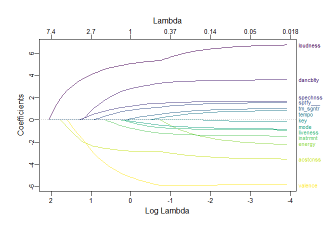<!-- -->

``` r
# arrange variables based on their LASSO importance
bool_predictor_exclude <- glmnet_output$beta==0

var_imp <- sapply(seq_len(nrow(bool_predictor_exclude)), function(row) {
    this_coeff_path <- bool_predictor_exclude[row,]
    if(sum(this_coeff_path) == ncol(bool_predictor_exclude)){ return(0)}else{
    return(ncol(bool_predictor_exclude) - which.min(this_coeff_path) + 1)}
})

var_imp_data <- tibble(
    var_name = rownames(bool_predictor_exclude),
    var_imp = var_imp
)
var_imp_data %>% arrange(desc(var_imp))
```

    ## # A tibble: 13 × 2
    ##    var_name                  var_imp
    ##    <chr>                       <dbl>
    ##  1 loudness                       64
    ##  2 acousticness                   61
    ##  3 valence                        59
    ##  4 speechiness                    56
    ##  5 danceability                   55
    ##  6 spotify_track_duration_ms      52
    ##  7 instrumentalness               49
    ##  8 liveness                       45
    ##  9 mode                           44
    ## 10 time_signature                 44
    ## 11 tempo                          37
    ## 12 energy                         34
    ## 13 key                            24

## Generalized Additive Model (GAM)

``` r
# residual plot: model selection

lasso_mod_out <- final_fit_se %>%
    predict(new_data = songs_sl) %>%
    bind_cols(songs_sl) %>%
    mutate(resid = spotify_track_popularity - .pred)

residplot1 <- lasso_mod_out %>% 
    ggplot(aes(x = .pred, y = resid)) + 
    geom_point(alpha = 0.2, color = "#f1abb9") +
    geom_smooth(color = "#7e6551", se = FALSE) + 
    geom_hline(yintercept = 0, color = "#f4f1de") + 
    theme_classic() +
    theme(plot.background = element_rect(fill = "black", color = "black"), panel.background = element_rect(color = "black", fill = "black"), text = element_text(color = "white"), axis.text=element_text(color="white"), axis.line =element_line(color = "white"))

residplot2 <- lasso_mod_out %>% 
    ggplot(aes(x = loudness, y = resid)) + 
    geom_point(alpha = 0.2, color = "#f1abb9") +
    geom_smooth(color = "#7e6551", se = FALSE) + 
    geom_hline(yintercept = 0, color = "#f4f1de") + 
    theme_classic() +
    theme(plot.background = element_rect(fill = "black", color = "black"), panel.background = element_rect(color = "black", fill = "black"), text = element_text(color = "white"), axis.text=element_text(color="white"), axis.line =element_line(color = "white"))

# png(filename="residplots.png", width=1600, height=600)
ggarrange(residplot1, residplot2)
```

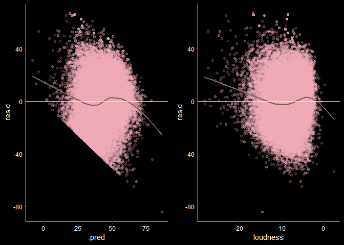<!-- -->

``` r
gam_spec <- 
    gen_additive_mod() %>%
    set_args(select_features = TRUE, adjust_deg_free = tune()) %>%
    set_engine(engine = "mgcv") %>%
    set_mode("regression")

gam_wf <- workflow() %>% 
    add_variables(outcomes = spotify_track_popularity, predictors = c(spotify_track_duration_ms, danceability, energy, loudness, mode, speechiness, acousticness, instrumentalness, liveness, valence, tempo, time_signature)) %>% 
    add_model(gam_spec, formula = spotify_track_popularity ~ mode + s(spotify_track_duration_ms, k=2) + s(danceability, k=2) + s(energy, k=2) + s(loudness, k=2) + s(speechiness, k=2) + s(acousticness, k=2) + s(instrumentalness, k=2) + s(liveness, k=2) + s(valence, k=2) + s(tempo, k=2) + s(time_signature, k=2))

tuning_param_grid <- grid_regular(
    adjust_deg_free(range = c(0.25, 4)),
    levels = 8
)

tune_output <- tune_grid( 
    gam_wf,
    resamples = songs_cv,
    metrics = metric_set(mae),
    grid = tuning_param_grid
)
```

``` r
tune_output %>% collect_metrics()
```

    ## # A tibble: 8 × 7
    ##   adjust_deg_free .metric .estimator  mean     n std_err .config             
    ##             <dbl> <chr>   <chr>      <dbl> <int>   <dbl> <chr>               
    ## 1           0.25  mae     standard    15.6    10  0.0633 Preprocessor1_Model1
    ## 2           0.786 mae     standard    15.6    10  0.0636 Preprocessor1_Model2
    ## 3           1.32  mae     standard    15.6    10  0.0641 Preprocessor1_Model3
    ## 4           1.86  mae     standard    15.6    10  0.0645 Preprocessor1_Model4
    ## 5           2.39  mae     standard    15.6    10  0.0647 Preprocessor1_Model5
    ## 6           2.93  mae     standard    15.6    10  0.0648 Preprocessor1_Model6
    ## 7           3.46  mae     standard    15.6    10  0.0648 Preprocessor1_Model7
    ## 8           4     mae     standard    15.6    10  0.0649 Preprocessor1_Model8

``` r
tune_output %>% show_best()
```

    ## # A tibble: 5 × 7
    ##   adjust_deg_free .metric .estimator  mean     n std_err .config             
    ##             <dbl> <chr>   <chr>      <dbl> <int>   <dbl> <chr>               
    ## 1           0.25  mae     standard    15.6    10  0.0633 Preprocessor1_Model1
    ## 2           0.786 mae     standard    15.6    10  0.0636 Preprocessor1_Model2
    ## 3           1.32  mae     standard    15.6    10  0.0641 Preprocessor1_Model3
    ## 4           1.86  mae     standard    15.6    10  0.0645 Preprocessor1_Model4
    ## 5           2.39  mae     standard    15.6    10  0.0647 Preprocessor1_Model5

``` r
autoplot(tune_output) + theme_classic()
```

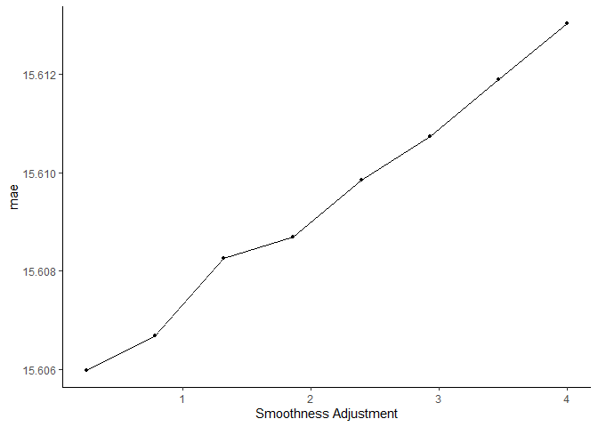<!-- -->

``` r
best_by_1se_param <- tune_output %>% 
    select_by_one_std_err(metric = "mae", desc(adjust_deg_free))

best_by_1se_param 
```

    ## # A tibble: 1 × 9
    ##   adjust_deg_free .metric .estimator  mean     n std_err .config    .best .bound
    ##             <dbl> <chr>   <chr>      <dbl> <int>   <dbl> <chr>      <dbl>  <dbl>
    ## 1               4 mae     standard    15.6    10  0.0649 Preproces…  15.6   15.7

``` r
gam_mod_best1se <- finalize_workflow(gam_wf, best_by_1se_param) %>%
    fit(data = songs_sl)
```

## Random Forest

``` r
set.seed(202)
rand_forest <- songs_sl %>%
  select(-c(song))
  
rf_spec <- rand_forest() %>%
    set_engine(engine = "ranger") %>% 
    set_args(
        mtry = NULL, 
        trees = 500, 
        min_n = 2,
        importance = "impurity"
    ) %>%
    set_mode("regression") 

data_rec <- recipe(spotify_track_popularity ~ ., data = rand_forest)

data_wf <- workflow() %>%
    add_model(rf_spec) %>%
    add_recipe(data_rec)

rf_fit <- fit(data_wf, data = rand_forest)


rf_fit
```

    ## ══ Workflow [trained] ══════════════════════════════════════════════════════════
    ## Preprocessor: Recipe
    ## Model: rand_forest()
    ## 
    ## ── Preprocessor ────────────────────────────────────────────────────────────────
    ## 0 Recipe Steps
    ## 
    ## ── Model ───────────────────────────────────────────────────────────────────────
    ## Ranger result
    ## 
    ## Call:
    ##  ranger::ranger(x = maybe_data_frame(x), y = y, num.trees = ~500,      min.node.size = min_rows(~2, x), importance = ~"impurity",      num.threads = 1, verbose = FALSE, seed = sample.int(10^5,          1)) 
    ## 
    ## Type:                             Regression 
    ## Number of trees:                  500 
    ## Sample size:                      29793 
    ## Number of independent variables:  13 
    ## Mtry:                             3 
    ## Target node size:                 2 
    ## Variable importance mode:         impurity 
    ## Splitrule:                        variance 
    ## OOB prediction error (MSE):       219.2205 
    ## R squared (OOB):                  0.5650864

``` r
# variable importance
rf_fit %>% 
    extract_fit_engine() %>% 
    vip(num_features = 13, aesthetics = list(color = "pink", fill = "pink")) + 
    theme_classic() +
    theme(plot.background = element_rect(fill = "black", color = "black"), panel.background = element_rect(color = "black", fill = "black"), text = element_text(color = "white"), axis.text=element_text(color="white"), axis.line =element_line(color = "white"))
```

<!-- -->

## Evaluate Model Performance and Variable Importance

``` r
songs %>%
  mutate(year = factor(year)) %>%
  ggplot(aes(x = year, y = spotify_track_popularity)) +
  geom_boxplot(fill = "#ffcfe3", color = "#ff9bc5") +
  geom_hline(yintercept = mean(songs$spotify_track_popularity), color = "white", linetype = "dotdash") +
  theme_classic() +
  theme(plot.background = element_rect(fill = "black", color = "black"), panel.background = element_rect(color = "black", fill = "black"), legend.background = element_rect(color = "black", fill = "black"), text = element_text(color = "white"), axis.text=element_text(color="white"), axis.line =element_line(color = "white"), axis.text.x =  element_text(angle = 90, size = 8))
```

<!-- -->

``` r
scat1 <- songs_sl %>% 
    ggplot(aes(x = loudness, y = spotify_track_popularity)) + 
    geom_point(alpha = 0.2, color = "#f1abb9") +
    geom_smooth(color = "white", se = FALSE) + 
    theme_classic() +
    theme(plot.background = element_rect(fill = "black", color = "black"), panel.background = element_rect(color = "black", fill = "black"), text = element_text(color = "white"), axis.text=element_text(color="white"), axis.line =element_line(color = "white"))

scat2 <- songs_sl %>% 
    ggplot(aes(x = valence, y = spotify_track_popularity)) + 
    geom_point(alpha = 0.2, color = "#f1abb9") +
    geom_smooth(color = "white", se = FALSE) + 
    theme_classic() +
    theme(plot.background = element_rect(fill = "black", color = "black"), panel.background = element_rect(color = "black", fill = "black"), text = element_text(color = "white"), axis.text=element_text(color="white"), axis.line =element_line(color = "white"))

scat3 <- songs_sl %>% 
    ggplot(aes(x = acousticness, y = spotify_track_popularity)) + 
    geom_point(alpha = 0.2, color = "#f1abb9") +
    geom_smooth(color = "white", se = FALSE) + 
    theme_classic() +
    theme(plot.background = element_rect(fill = "black", color = "black"), panel.background = element_rect(color = "black", fill = "black"), text = element_text(color = "white"), axis.text=element_text(color="white"), axis.line =element_line(color = "white"))

scat4 <- songs_sl %>% 
    ggplot(aes(x = speechiness, y = spotify_track_popularity)) + 
    geom_point(alpha = 0.2, color = "#f1abb9") +
    geom_smooth(color = "white", se = FALSE) + 
    theme_classic() +
    theme(plot.background = element_rect(fill = "black", color = "black"), panel.background = element_rect(color = "black", fill = "black"), text = element_text(color = "white"), axis.text=element_text(color="white"), axis.line =element_line(color = "white"))

# png(filename="scatterplots.png", width=1600, height=1000)
ggarrange(scat1, scat2, scat3, scat4, ncol = 2, nrow = 2)
```

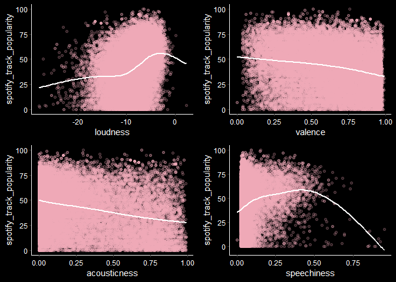<!-- -->

# Part 3. Unsupervised Learning: Identify Song Clusters across Decades among Important Audio Features

## Data Cleaning

``` r
songs_2000s <- songs %>%
  filter(year >= 2000 & year <= 2009) %>%
  select(valence, acousticness, loudness)

songs_2010s <- songs %>%
  filter(year >= 2010 & year <= 2019) %>%
  select(valence, acousticness, loudness)
```

## Picking $k$

``` r
tot_wc_ss_2000 <- rep(0, 15)

for (k in 1:15) {
    kclust_2000 <- kmeans(scale(songs_2000s), centers = k)

    tot_wc_ss_2000[k] <- kclust_2000$tot.withinss
}

tot_wc_ss_2010 <- rep(0, 15)


for (k in 1:15) {
    # Perform clustering
    kclust_2010 <- kmeans(scale(songs_2010s), centers = k)

    # Store the total within-cluster sum of squares
    tot_wc_ss_2010[k] <- kclust_2010$tot.withinss
}
```

``` r
# png(filename="k_plot.png", width=1600, height=600)

par(bg = "black", mfrow = c(1, 2))
plot(1:15, tot_wc_ss_2000, type = "b", main = "2000s", xlab = "Number of clusters", ylab = "Total within-cluster sum of squares", col = "pink",           
    col.main = "white",    
    col.lab = "white",    
    col.axis = "white",   
    fg = "white")

plot(1:15, tot_wc_ss_2010, type = "b", main = "2010s", xlab = "Number of clusters", ylab = "Total within-cluster sum of squares", col = "pink",           
    col.main = "white",   
    col.lab = "white",    
    col.axis = "white",   
    fg = "white") 
```

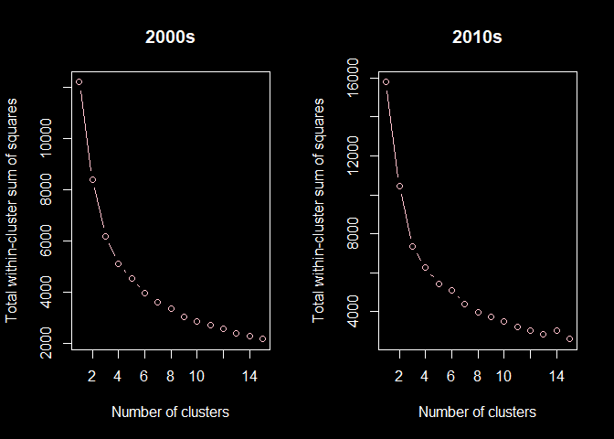<!-- -->

## K-Means Clustering

``` r
set.seed(202)
kclust_2000_scale <- kmeans(scale(songs_2000s), centers = 6)
kclust_2000_scale
```

    ## K-means clustering with 6 clusters of sizes 1061, 677, 1034, 522, 320, 450
    ## 
    ## Cluster means:
    ##      valence acousticness   loudness
    ## 1 -0.7526189   -0.5067981  0.5490538
    ## 2  0.6597654   -0.3546426 -0.7217651
    ## 3  0.9345917   -0.4578225  0.7668921
    ## 4 -1.0028351   -0.1009397 -1.0362817
    ## 5 -0.9915701    2.4044131 -1.3157628
    ## 6  0.5028488    1.1877168  0.1669012
    ## 
    ## Clustering vector:
    ##    [1] 5 3 4 3 1 3 6 3 1 1 3 3 5 4 3 1 1 2 1 3 3 6 4 6 5 1 3 6 4 1 2 1 3 3 4 3 6
    ##   [38] 4 3 2 4 1 6 2 4 1 3 6 6 4 1 3 4 2 3 2 2 3 5 1 5 2 3 3 4 4 2 3 5 3 6 2 4 5
    ##   [75] 3 4 3 3 2 4 1 1 4 3 2 4 6 4 2 6 4 3 5 4 4 6 3 5 2 3 4 6 1 2 4 6 6 3 6 2 3
    ##  [112] 3 4 2 6 1 3 3 2 4 1 5 2 1 3 2 3 3 3 1 3 4 6 2 3 6 1 2 2 3 2 6 4 1 5 2 2 2
    ##  [149] 2 2 2 2 3 1 5 2 3 2 3 5 4 1 2 2 3 6 2 3 1 2 4 4 2 4 4 2 4 2 2 3 2 2 4 2 2
    ##  [186] 6 3 5 2 1 4 2 6 2 3 6 4 6 5 4 5 5 4 1 5 1 2 3 2 6 2 1 4 1 6 2 5 1 1 4 6 5
    ##  [223] 2 2 2 3 1 2 1 6 2 2 5 5 4 6 6 6 6 2 2 4 4 1 3 3 3 4 4 1 5 2 6 1 4 2 2 3 6
    ##  [260] 2 2 3 5 3 3 2 2 6 4 1 3 1 3 6 4 6 4 4 4 6 4 5 1 2 6 4 5 2 2 2 1 1 4 2 1 3
    ##  [297] 2 4 1 5 2 4 4 3 2 4 2 2 2 3 2 3 3 4 4 1 2 2 3 6 6 4 2 4 1 2 4 1 2 2 2 5 1
    ##  [334] 2 1 2 6 4 5 2 1 2 6 4 1 6 3 2 2 3 3 3 3 5 5 3 1 4 3 3 2 6 3 1 3 4 1 2 5 3
    ##  [371] 2 4 4 2 6 3 2 2 3 1 4 2 4 5 2 5 4 6 2 1 1 1 2 3 4 3 3 6 3 5 2 1 3 1 6 1 3
    ##  [408] 3 6 6 6 3 4 3 1 1 1 2 1 2 2 3 6 3 4 6 4 3 1 1 1 3 3 1 2 2 1 4 2 6 5 2 3 2
    ##  [445] 5 4 1 2 4 5 2 2 2 2 3 5 6 1 2 4 1 5 6 1 3 3 1 3 2 1 2 6 5 3 6 3 3 2 3 5 3
    ##  [482] 2 3 6 6 3 1 2 4 6 2 2 2 1 1 1 1 5 3 1 1 5 3 6 2 6 3 3 1 2 1 3 3 4 3 3 3 6
    ##  [519] 6 3 2 3 5 4 2 3 1 4 6 2 2 2 4 2 4 1 5 1 3 3 6 3 3 3 3 3 5 2 4 2 6 2 4 3 3
    ##  [556] 3 5 4 2 2 4 6 1 3 2 3 2 3 3 6 4 3 2 3 4 3 3 5 3 4 5 4 1 3 5 6 3 2 4 3 3 6
    ##  [593] 3 1 1 2 1 3 3 4 4 3 4 2 3 4 2 2 2 3 5 3 1 5 2 3 2 6 1 4 2 2 2 3 4 2 3 3 6
    ##  [630] 3 5 3 5 2 3 1 5 1 1 1 3 1 1 3 6 1 3 2 2 2 6 2 4 4 3 4 4 4 2 3 6 6 4 1 5 2
    ##  [667] 2 3 5 4 4 6 1 3 2 1 1 2 5 2 1 5 3 3 2 1 3 5 6 1 4 2 1 2 2 5 4 5 6 3 4 3 2
    ##  [704] 3 2 4 5 2 6 1 1 2 1 1 3 2 2 3 1 3 1 4 1 4 1 6 1 2 3 3 1 3 1 4 2 5 1 3 2 1
    ##  [741] 1 2 2 6 1 1 1 1 5 3 1 2 5 3 2 2 3 5 1 1 3 3 5 2 1 3 3 6 4 3 4 1 1 6 2 2 1
    ##  [778] 3 5 3 3 6 4 1 1 4 1 3 6 2 1 5 6 3 6 1 4 2 3 3 3 1 6 1 3 3 4 1 3 3 1 3 4 1
    ##  [815] 1 3 3 3 3 3 3 4 6 3 1 4 2 5 3 3 3 3 2 1 1 4 1 1 1 3 3 3 4 6 3 2 1 1 6 1 2
    ##  [852] 5 4 1 4 1 5 4 1 5 6 6 3 4 4 6 4 3 3 6 2 2 2 5 3 2 6 2 3 3 6 1 6 4 1 2 6 3
    ##  [889] 3 6 2 3 4 6 3 3 6 6 4 1 3 4 2 6 1 5 3 6 2 3 3 3 2 3 4 2 6 1 2 1 2 3 3 2 3
    ##  [926] 3 2 6 4 1 3 3 2 6 5 3 5 1 4 5 3 5 1 1 5 5 5 3 6 2 4 3 3 6 3 2 3 1 1 4 5 2
    ##  [963] 1 2 1 3 6 6 1 6 1 3 2 3 1 1 2 2 3 1 3 3 2 3 6 1 4 2 3 1 1 6 4 3 5 1 2 1 5
    ## [1000] 4 1 6 3 2 1 5 5 4 2 3 3 6 1 5 1 4 3 3 6 4 3 3 2 4 4 1 3 2 2 2 3 1 6 4 1 1
    ## [1037] 1 2 1 3 1 3 3 2 4 2 1 6 1 4 1 6 2 4 1 3 6 5 1 4 4 3 3 4 6 6 5 5 1 6 3 2 2
    ## [1074] 1 3 1 2 5 3 3 4 1 6 1 2 4 4 1 4 1 6 2 2 3 3 2 2 5 3 1 4 1 4 4 1 3 5 3 6 1
    ## [1111] 1 4 3 1 5 1 4 3 4 6 3 1 1 2 5 3 2 3 3 1 5 6 4 3 2 1 3 1 3 1 1 3 6 1 6 1 1
    ## [1148] 1 1 1 1 1 4 2 1 1 2 3 1 6 3 5 1 3 2 4 2 4 4 6 3 2 3 3 3 5 3 1 4 2 1 1 3 1
    ## [1185] 4 2 2 1 2 1 1 5 1 5 6 3 3 1 2 3 2 1 4 3 2 3 4 2 5 1 3 3 6 1 3 3 4 4 1 1 5
    ## [1222] 1 1 3 3 3 5 3 1 1 2 3 3 1 3 4 6 2 3 5 3 1 4 5 3 3 2 5 2 4 4 1 1 1 2 2 1 3
    ## [1259] 1 4 6 6 2 3 4 2 4 1 6 4 3 1 1 4 3 5 6 3 2 3 1 3 3 3 1 4 2 6 6 1 3 5 3 3 1
    ## [1296] 4 2 6 2 4 1 1 2 2 3 3 6 5 2 3 3 4 4 6 3 3 2 6 2 2 5 1 3 1 4 1 1 3 4 3 6 5
    ## [1333] 5 2 5 3 6 5 3 5 3 4 2 5 6 2 5 2 3 2 6 4 6 2 3 1 3 1 6 3 4 1 3 5 5 6 6 3 2
    ## [1370] 2 1 4 6 2 6 2 1 5 3 2 1 3 1 1 6 3 3 4 2 6 1 3 4 5 4 1 3 2 3 1 3 1 6 3 3 2
    ## [1407] 3 5 3 5 2 3 3 3 1 3 6 6 3 2 1 3 5 4 4 3 3 4 1 3 1 1 1 1 1 2 1 3 4 1 4 3 5
    ## [1444] 4 3 1 5 3 3 3 1 1 5 1 3 3 4 1 1 1 3 3 5 2 3 6 5 5 6 6 3 1 2 4 5 1 4 4 3 1
    ## [1481] 3 3 3 1 6 1 3 4 4 3 4 3 3 1 5 5 3 1 1 1 6 1 2 1 5 3 1 5 1 3 3 2 3 5 5 2 3
    ## [1518] 3 2 3 2 2 6 6 6 4 3 2 2 3 3 3 3 2 1 1 3 3 5 1 1 4 5 1 3 2 2 6 3 4 4 2 1 2
    ## [1555] 2 3 2 3 3 1 1 2 3 3 5 1 3 5 4 1 2 4 2 1 2 2 6 2 6 3 3 3 4 2 5 2 6 3 6 1 1
    ## [1592] 3 3 3 3 5 5 2 6 6 2 6 5 2 2 6 6 3 2 5 6 1 2 3 1 1 3 1 1 6 2 2 1 1 5 1 1 1
    ## [1629] 1 1 4 1 3 6 1 1 3 1 3 1 2 3 4 3 4 3 4 1 1 1 6 1 1 3 3 1 1 4 3 4 1 2 2 6 5
    ## [1666] 3 4 2 3 6 4 1 1 1 5 2 3 6 2 3 6 3 6 1 1 4 1 3 2 4 3 3 2 2 2 1 5 3 1 1 3 6
    ## [1703] 2 1 1 3 4 1 2 2 3 3 2 1 2 2 3 6 6 3 4 4 5 3 6 6 3 2 2 1 4 1 1 3 2 3 3 1 3
    ## [1740] 3 1 3 2 1 5 2 3 1 5 4 5 2 6 4 1 3 1 3 4 4 3 3 4 4 3 4 2 3 4 3 6 5 6 3 6 2
    ## [1777] 3 4 6 2 5 6 2 6 4 3 4 5 2 3 4 4 2 1 1 4 6 1 3 2 2 4 6 1 6 6 2 1 1 3 1 1 3
    ## [1814] 1 3 1 3 5 3 1 2 6 2 3 3 4 3 1 4 1 1 6 1 1 2 6 3 3 3 4 3 2 6 3 1 4 1 3 3 1
    ## [1851] 3 3 3 2 1 6 2 3 5 1 2 1 6 3 3 2 5 3 2 6 4 2 1 1 4 1 5 2 1 3 3 1 6 3 6 4 2
    ## [1888] 4 2 6 3 6 2 5 2 2 2 2 6 2 1 2 1 1 1 1 3 1 6 1 1 6 2 2 1 3 6 2 6 3 3 4 3 1
    ## [1925] 1 6 2 2 4 1 2 1 4 1 4 6 5 4 1 2 1 1 2 1 6 1 4 3 3 4 2 1 1 3 6 6 1 4 1 1 1
    ## [1962] 1 6 1 1 2 5 1 4 2 4 1 1 3 3 1 6 2 5 1 1 5 3 3 1 2 3 6 5 1 2 3 1 3 4 2 1 2
    ## [1999] 3 1 3 3 1 4 5 4 3 3 4 6 4 3 5 4 3 5 3 5 6 3 4 2 1 6 5 3 2 1 1 3 2 1 1 2 6
    ## [2036] 4 2 1 3 1 3 4 3 5 6 6 5 3 4 2 3 5 1 1 2 6 1 1 1 3 5 3 2 1 2 2 2 3 1 3 2 4
    ## [2073] 3 3 4 2 1 1 1 5 5 5 5 2 2 2 3 2 5 2 3 3 1 2 1 1 4 2 2 3 1 1 3 5 3 3 5 4 3
    ## [2110] 2 1 1 5 1 3 1 5 6 4 2 6 1 2 1 3 5 2 2 2 3 4 6 1 5 2 3 5 4 4 3 2 4 1 2 1 2
    ## [2147] 3 4 2 1 3 2 4 3 2 1 2 3 6 2 2 3 1 4 1 5 5 3 5 1 4 1 2 5 4 6 6 1 2 2 1 3 4
    ## [2184] 1 3 3 1 6 1 4 5 4 3 6 1 6 1 1 3 1 6 2 1 4 1 6 3 1 2 3 2 2 3 3 2 3 3 3 6 2
    ## [2221] 4 3 1 3 5 1 3 1 3 3 2 1 6 5 3 5 2 4 3 3 5 3 1 1 6 1 2 4 5 4 1 1 2 1 1 3 2
    ## [2258] 6 1 6 1 6 4 1 1 1 3 1 1 1 3 3 1 3 2 3 2 2 2 3 6 1 3 6 1 2 5 3 2 4 6 1 1 1
    ## [2295] 4 3 2 2 4 1 3 3 3 1 1 3 1 3 4 1 1 2 1 3 3 2 3 5 6 3 2 6 1 1 1 1 2 1 5 2 2
    ## [2332] 1 2 1 4 2 2 3 2 3 1 3 4 3 1 2 6 3 2 1 4 1 3 6 2 4 5 1 3 1 3 3 4 3 1 3 1 3
    ## [2369] 1 1 4 1 2 1 1 5 1 2 6 3 1 4 3 2 3 1 4 1 6 2 1 3 3 3 6 5 6 3 1 1 3 4 2 1 3
    ## [2406] 3 2 3 6 1 2 3 3 3 4 6 3 4 5 3 3 6 2 3 3 1 2 6 4 4 1 3 3 1 1 1 6 6 3 3 4 1
    ## [2443] 6 2 3 4 2 5 1 2 1 6 1 2 2 6 6 3 2 1 1 1 1 2 6 1 3 1 2 4 3 6 4 2 2 2 3 3 3
    ## [2480] 1 1 4 4 4 3 5 2 1 1 1 5 6 3 1 4 4 4 5 1 3 1 4 6 3 2 2 6 1 1 4 2 6 4 3 4 2
    ## [2517] 5 3 1 3 4 1 1 2 2 3 3 3 2 1 3 3 6 1 6 6 2 4 6 1 1 3 3 5 3 6 6 1 3 5 6 2 4
    ## [2554] 1 2 6 4 1 2 3 3 6 4 1 3 3 1 2 4 3 2 1 1 1 2 2 1 2 4 3 2 1 1 5 3 6 1 4 1 1
    ## [2591] 2 2 1 3 3 4 3 1 3 4 4 6 1 3 3 3 4 5 2 6 2 1 1 2 5 1 2 1 4 4 1 2 3 2 2 6 5
    ## [2628] 2 3 2 4 2 3 1 4 1 2 6 2 1 3 1 3 6 4 1 2 3 1 6 3 5 3 3 1 1 3 4 3 6 6 3 1 3
    ## [2665] 2 4 3 1 3 3 1 3 1 1 1 5 1 1 3 4 2 1 4 3 1 2 6 4 3 3 2 1 3 1 4 3 2 1 2 4 1
    ## [2702] 1 1 4 3 2 1 2 6 3 1 1 1 3 6 2 4 1 3 4 1 3 4 1 3 1 6 3 1 2 3 4 3 4 5 6 1 1
    ## [2739] 5 1 2 1 2 6 1 2 2 1 3 2 6 5 6 6 4 3 3 4 5 2 1 4 2 3 3 4 1 1 5 3 5 4 3 3 2
    ## [2776] 6 6 3 1 1 4 3 5 3 3 2 3 3 1 3 4 3 3 1 2 1 4 1 2 4 6 4 5 2 3 5 1 6 3 5 3 3
    ## [2813] 1 4 3 2 1 4 5 1 4 1 1 3 4 1 4 4 1 3 1 5 6 6 3 3 2 1 3 1 1 6 2 3 6 5 1 3 5
    ## [2850] 1 6 6 1 6 5 2 2 5 1 2 6 1 1 3 1 4 3 5 4 3 3 6 1 1 1 4 3 6 6 3 3 4 3 5 2 2
    ## [2887] 1 1 6 2 4 3 1 1 6 3 1 3 2 1 3 3 5 2 3 1 4 3 3 3 3 2 4 3 3 1 2 1 1 4 3 3 3
    ## [2924] 5 1 6 1 6 3 1 1 2 5 1 3 1 4 1 1 1 3 6 6 6 6 1 2 1 3 1 6 3 6 2 2 3 6 3 1 6
    ## [2961] 4 6 4 6 4 4 3 3 3 5 1 1 1 5 2 1 1 1 3 3 3 1 6 4 1 2 5 3 2 3 2 6 1 6 3 4 1
    ## [2998] 1 2 1 1 3 3 2 1 1 5 4 3 4 2 6 1 1 1 2 1 3 3 3 2 6 1 1 6 4 2 5 1 3 6 6 4 3
    ## [3035] 3 1 3 1 3 6 5 4 2 3 2 2 3 4 2 6 1 5 3 1 1 1 1 2 3 3 3 1 2 1 1 1 4 3 1 1 3
    ## [3072] 3 2 4 6 3 1 1 1 2 5 3 3 3 1 3 5 3 1 6 1 4 4 1 3 1 3 6 1 6 2 1 3 1 3 3 1 1
    ## [3109] 1 4 3 2 1 2 6 3 6 3 3 1 6 3 3 3 4 3 3 4 1 4 1 4 2 2 3 1 3 4 1 3 1 4 6 3 3
    ## [3146] 3 3 3 4 6 1 2 5 1 3 2 1 2 3 1 1 3 2 1 1 5 1 1 1 3 3 1 1 1 1 1 1 2 2 2 1 1
    ## [3183] 6 3 1 1 1 5 5 3 3 3 3 6 1 4 3 4 2 1 4 4 3 4 2 6 1 3 1 4 3 2 5 1 5 1 6 3 6
    ## [3220] 5 4 1 6 3 1 1 1 2 3 1 6 1 6 1 1 3 1 6 4 4 6 6 2 2 1 3 3 4 1 1 6 1 5 3 1 2
    ## [3257] 3 1 1 1 2 2 1 3 3 3 1 3 6 3 6 1 1 2 3 1 1 1 1 4 3 1 1 1 1 1 6 3 5 3 5 3 3
    ## [3294] 3 3 3 2 5 4 4 4 4 1 3 1 3 5 5 3 6 3 3 2 6 5 2 1 3 3 1 3 4 3 3 1 1 4 5 2 1
    ## [3331] 1 1 2 4 6 1 1 2 1 6 2 4 4 1 4 4 3 6 3 2 3 1 4 1 6 3 1 2 1 5 1 1 2 5 1 1 3
    ## [3368] 4 2 3 1 1 4 2 5 2 5 1 5 5 2 3 1 5 1 1 3 3 6 3 1 1 6 3 1 1 1 5 1 3 3 2 1 4
    ## [3405] 5 3 2 6 1 3 1 3 6 5 4 3 1 6 5 1 3 1 3 1 6 6 3 4 3 2 1 3 5 3 4 1 1 2 1 1 6
    ## [3442] 4 5 1 3 2 1 3 1 6 5 3 3 1 1 2 4 1 1 6 1 4 6 1 1 4 4 4 1 1 1 4 1 4 1 2 4 1
    ## [3479] 1 1 3 4 3 1 1 4 3 1 1 6 1 3 2 3 4 1 6 4 5 3 1 6 4 2 3 1 1 2 2 3 3 3 1 3 3
    ## [3516] 6 1 6 4 3 1 1 2 2 3 1 1 3 4 2 3 6 2 2 2 2 3 3 6 3 3 4 3 1 1 3 1 4 3 5 5 3
    ## [3553] 3 1 1 3 1 3 1 3 1 6 1 1 2 4 6 5 3 4 3 1 4 1 5 3 3 3 3 1 6 5 1 3 4 3 4 1 1
    ## [3590] 2 2 4 1 6 2 1 1 6 6 1 3 4 3 4 3 1 5 1 2 1 3 2 3 5 6 1 3 1 3 1 5 1 3 2 2 1
    ## [3627] 4 2 1 1 3 3 1 2 4 1 1 4 6 3 3 3 4 2 3 3 3 3 4 1 1 3 1 6 4 5 5 1 1 3 3 1 3
    ## [3664] 2 4 6 3 2 4 3 1 6 1 5 3 3 3 3 1 3 2 1 3 3 1 1 1 3 2 4 5 5 4 1 3 3 3 3 2 3
    ## [3701] 6 5 3 4 3 1 3 3 1 1 3 5 1 3 3 2 4 1 6 4 6 3 1 2 5 2 2 3 3 2 3 3 4 2 4 1 1
    ## [3738] 5 3 2 3 3 1 3 3 3 4 3 5 3 4 3 3 4 5 5 2 3 5 1 1 3 4 5 1 1 2 5 1 1 3 2 3 4
    ## [3775] 1 1 1 6 4 1 3 6 5 3 1 1 3 3 3 1 2 3 5 3 4 2 4 1 6 2 2 1 1 6 3 6 2 2 1 6 1
    ## [3812] 1 4 6 1 1 3 1 4 1 5 3 6 6 3 1 1 1 6 2 3 1 3 4 3 3 1 1 3 3 6 3 3 4 1 5 1 1
    ## [3849] 5 3 5 4 5 1 1 1 1 6 1 5 1 4 1 2 5 2 1 2 5 6 3 1 6 2 1 1 4 1 6 3 4 1 1 2 1
    ## [3886] 1 4 1 1 6 1 4 6 3 1 1 1 4 4 6 2 1 1 1 2 4 3 2 3 5 1 3 1 1 2 3 3 1 3 1 1 3
    ## [3923] 3 4 4 1 1 3 1 1 3 4 1 6 1 6 3 2 4 3 3 1 1 3 1 4 3 1 6 3 3 1 3 2 1 3 1 6 1
    ## [3960] 4 1 1 1 2 2 4 3 6 6 1 1 4 1 1 4 1 3 4 6 5 6 1 3 2 2 6 1 1 1 2 3 2 3 1 6 6
    ## [3997] 3 1 1 4 5 1 5 1 6 1 1 4 1 3 1 2 1 6 4 1 5 3 6 4 4 1 1 1 6 4 3 1 3 1 3 1 1
    ## [4034] 2 1 2 3 3 1 2 1 1 1 1 2 3 3 3 5 1 6 1 6 1 1 4 4 6 4 6 4 3 1 1
    ## 
    ## Within cluster sum of squares by cluster:
    ## [1] 748.2864 607.3609 629.8729 642.2403 792.0553 544.7327
    ##  (between_SS / total_SS =  67.5 %)
    ## 
    ## Available components:
    ## 
    ## [1] "cluster"      "centers"      "totss"        "withinss"     "tot.withinss"
    ## [6] "betweenss"    "size"         "iter"         "ifault"

``` r
kclust_2010_scale <- kmeans(scale(songs_2010s), centers = 6)
kclust_2010_scale
```

    ## K-means clustering with 6 clusters of sizes 629, 753, 1068, 1351, 1176, 286
    ## 
    ## Cluster means:
    ##      valence acousticness   loudness
    ## 1 -0.2430311    1.6084966 -0.2311172
    ## 2 -0.3624046   -0.3339765 -1.1384600
    ## 3 -1.0562048   -0.4006677  0.1922044
    ## 4  0.1387266   -0.4574471  0.6394747
    ## 5  1.3398359   -0.3422683  0.4949478
    ## 6 -0.7317577    2.4061942 -2.2679378
    ## 
    ## Clustering vector:
    ##    [1] 2 5 4 4 4 1 6 5 5 3 3 5 3 5 5 4 3 1 3 3 4 1 6 2 5 5 3 1 3 5 4 4 3 4 4 4 5
    ##   [38] 4 3 2 4 3 4 2 5 4 4 3 5 4 4 5 5 4 5 4 4 5 5 3 3 5 4 5 3 6 5 3 4 4 3 3 5 6
    ##   [75] 5 5 2 4 2 3 5 4 4 3 4 5 3 4 5 5 6 4 2 4 4 4 4 1 5 5 4 4 4 3 4 5 5 5 5 5 3
    ##  [112] 3 5 4 6 4 5 5 5 4 3 5 4 3 1 3 5 1 6 5 2 4 4 5 6 6 3 2 3 5 3 2 5 4 4 5 3 5
    ##  [149] 5 1 3 3 3 5 5 5 4 4 6 1 5 5 4 5 4 5 4 5 4 5 1 1 4 5 3 3 5 3 1 4 5 4 4 1 2
    ##  [186] 3 1 3 3 4 5 3 3 4 4 5 1 6 4 3 5 1 3 1 5 3 1 5 5 5 5 1 3 6 6 1 4 6 5 1 4 5
    ##  [223] 4 2 4 4 1 3 1 6 1 5 6 1 5 3 5 5 3 4 1 4 3 4 5 3 5 2 4 3 3 5 3 5 3 2 5 5 6
    ##  [260] 4 5 1 4 4 3 4 5 1 5 1 1 5 3 4 4 5 2 5 3 5 5 5 3 4 5 4 4 3 4 5 4 1 3 2 4 5
    ##  [297] 4 3 4 3 1 3 3 2 3 2 4 5 1 4 3 4 2 3 4 1 4 5 5 5 6 4 3 5 4 5 3 4 2 2 5 5 4
    ##  [334] 3 1 1 4 4 4 4 4 6 4 1 5 1 5 1 3 5 3 4 5 5 1 4 1 3 5 5 5 3 3 3 4 5 2 3 2 2
    ##  [371] 4 3 1 4 4 4 4 5 3 5 1 4 3 5 4 2 1 3 6 6 5 4 5 5 3 5 3 1 5 2 5 4 6 2 4 3 3
    ##  [408] 5 2 4 4 5 4 2 4 5 4 2 3 4 4 5 4 5 5 4 3 5 2 3 6 1 4 4 4 3 1 5 1 4 3 5 2 2
    ##  [445] 5 3 5 4 4 4 5 3 5 4 2 4 5 5 1 4 4 3 1 5 4 4 4 2 1 2 4 4 3 4 5 2 4 4 3 4 5
    ##  [482] 3 2 4 5 2 4 2 5 3 4 5 4 4 4 1 4 5 3 4 3 4 5 5 4 2 1 5 5 2 1 4 3 5 5 5 4 4
    ##  [519] 5 5 2 4 3 3 4 5 3 1 5 4 4 2 5 5 4 3 5 3 5 5 6 3 3 3 5 4 5 4 5 4 2 3 5 1 4
    ##  [556] 4 3 3 3 4 1 4 6 6 3 6 3 3 3 3 3 5 4 1 5 5 3 4 1 3 5 4 4 4 3 5 3 4 1 5 5 3
    ##  [593] 6 6 4 3 5 5 4 1 3 6 3 5 5 4 5 6 5 4 3 1 4 4 5 1 6 3 3 4 4 4 3 4 4 5 4 5 5
    ##  [630] 1 4 4 4 5 5 1 4 4 3 4 3 1 3 5 1 3 2 1 3 4 4 3 5 2 5 1 3 1 3 5 4 5 4 5 4 3
    ##  [667] 3 4 4 3 1 5 5 1 3 5 2 4 3 3 4 4 4 6 4 6 4 3 4 3 5 1 3 4 5 3 2 3 2 4 5 4 1
    ##  [704] 5 4 5 4 4 5 3 3 3 4 6 5 4 4 5 5 3 5 5 6 1 3 3 5 1 5 2 3 5 5 4 1 5 2 4 5 3
    ##  [741] 4 5 4 1 4 4 3 4 4 4 5 5 2 1 5 4 5 4 5 1 4 4 5 4 2 4 4 6 4 3 1 4 1 3 4 5 5
    ##  [778] 5 5 5 1 1 3 5 1 3 4 4 6 3 4 4 3 3 5 5 4 5 4 3 4 5 3 5 4 1 4 3 4 5 4 4 1 4
    ##  [815] 5 2 5 5 3 4 4 3 5 2 4 5 4 4 5 4 3 5 1 5 3 2 5 4 5 5 3 1 6 2 6 5 5 4 1 2 5
    ##  [852] 3 2 1 2 4 5 5 1 3 3 1 4 5 5 5 4 3 3 3 5 4 3 3 5 4 3 4 1 5 4 3 4 5 4 2 1 3
    ##  [889] 4 3 4 5 2 2 3 5 4 4 1 5 4 5 2 6 6 4 5 4 3 5 1 5 4 5 3 3 1 1 3 2 4 5 4 1 4
    ##  [926] 4 5 5 4 6 4 5 1 1 4 1 4 3 4 3 4 5 3 4 4 4 5 6 3 4 2 4 4 2 4 3 5 4 4 5 4 4
    ##  [963] 3 2 4 4 3 4 4 4 1 6 3 3 4 4 3 4 3 4 5 4 2 4 4 5 2 2 3 4 2 6 5 5 3 4 5 4 1
    ## [1000] 5 3 4 1 4 1 5 3 4 4 5 4 2 4 5 5 3 2 6 3 3 4 4 4 6 4 3 4 5 4 4 4 5 3 3 3 4
    ## [1037] 4 4 4 5 3 3 5 4 1 3 5 5 5 5 4 5 2 2 5 5 5 5 1 1 3 3 5 4 4 3 5 4 3 4 3 4 3
    ## [1074] 4 5 3 5 2 4 3 5 5 4 1 3 2 4 5 4 5 4 1 1 4 3 4 5 5 1 4 1 1 4 5 3 5 1 1 4 1
    ## [1111] 4 4 3 4 5 1 4 4 5 1 1 4 4 5 3 4 2 1 5 4 5 2 4 4 4 4 3 3 5 5 2 5 6 4 5 3 4
    ## [1148] 5 3 1 1 5 6 4 3 1 3 4 2 5 5 5 1 5 2 5 1 4 5 3 4 1 4 4 3 3 4 4 4 1 2 4 1 2
    ## [1185] 4 5 5 4 4 4 4 4 6 3 5 4 3 4 4 5 4 5 3 2 4 5 6 4 4 2 3 1 3 1 5 5 4 5 3 3 2
    ## [1222] 6 3 4 5 5 3 4 1 5 1 1 5 5 5 3 1 5 3 4 3 2 4 5 4 3 5 5 5 2 4 6 3 4 4 4 3 2
    ## [1259] 4 5 3 5 3 4 3 4 4 2 3 4 4 6 2 5 4 5 4 6 3 1 4 5 3 5 4 3 2 3 5 4 4 4 2 5 4
    ## [1296] 5 3 5 5 5 4 5 5 5 3 2 3 4 3 3 5 4 5 5 4 3 4 6 2 2 5 3 2 3 2 5 5 4 1 5 3 5
    ## [1333] 6 4 3 3 2 4 2 5 1 5 5 5 3 5 2 3 3 1 4 5 2 1 5 4 4 4 6 5 3 1 4 5 4 5 3 1 6
    ## [1370] 4 5 3 4 4 4 4 3 2 4 5 3 4 4 5 6 3 2 5 4 5 4 1 1 1 3 2 3 4 4 5 6 5 5 5 4 4
    ## [1407] 4 5 2 5 4 2 3 5 4 4 3 3 5 4 2 5 4 5 2 1 5 5 4 5 5 2 4 3 2 4 4 4 4 4 4 5 5
    ## [1444] 3 5 4 4 3 3 3 3 4 1 4 2 5 3 1 4 5 4 3 2 5 5 4 5 4 2 5 5 5 6 5 6 6 1 5 4 4
    ## [1481] 2 5 3 4 5 5 4 5 5 4 4 4 3 1 4 3 5 4 4 5 4 4 1 1 1 4 4 1 4 5 2 4 5 1 4 4 5
    ## [1518] 1 4 3 4 5 4 4 5 6 5 5 5 5 2 1 4 3 4 5 5 5 4 2 5 4 5 1 5 4 2 4 1 3 3 5 3 5
    ## [1555] 6 2 6 5 3 3 4 4 6 5 3 5 2 5 4 4 5 3 3 3 6 4 4 5 1 3 4 3 4 5 4 3 3 1 3 5 2
    ## [1592] 4 5 3 4 5 1 3 5 3 5 6 6 6 3 5 3 2 6 3 4 4 2 4 1 3 3 4 5 4 1 4 5 4 1 3 4 5
    ## [1629] 5 2 1 6 3 3 6 3 4 1 3 3 5 3 4 4 4 3 4 2 4 4 1 1 4 4 2 3 5 2 2 4 4 1 5 4 5
    ## [1666] 4 2 4 5 4 3 3 3 4 3 3 2 3 1 5 5 5 2 3 4 4 1 3 2 5 5 3 4 3 5 3 4 2 5 3 2 4
    ## [1703] 1 5 5 4 2 4 4 5 2 4 4 2 3 2 2 1 4 6 4 5 2 1 6 5 5 1 5 5 2 5 4 4 1 5 4 4 3
    ## [1740] 3 5 5 6 5 3 5 6 5 3 5 3 4 3 1 5 2 4 3 4 4 1 5 6 4 4 5 5 4 2 4 5 3 1 4 6 1
    ## [1777] 5 4 2 5 4 2 4 3 3 5 5 4 5 4 5 6 4 2 2 3 4 1 1 4 3 5 3 5 5 6 2 3 4 5 4 2 2
    ## [1814] 4 3 1 4 2 3 4 3 5 5 6 2 4 3 5 4 1 6 5 4 3 1 2 5 4 5 3 3 1 5 4 4 3 1 4 5 5
    ## [1851] 2 3 6 4 5 5 2 4 1 5 5 4 4 4 4 3 4 1 4 6 4 5 3 5 5 4 5 5 5 4 2 2 3 3 3 4 2
    ## [1888] 3 5 2 4 5 1 2 4 1 4 4 2 4 2 5 5 5 2 4 1 4 4 1 3 5 4 1 4 4 4 4 3 2 4 4 3 3
    ## [1925] 4 5 2 3 5 4 4 4 2 3 6 3 4 4 2 5 5 3 5 1 2 3 4 5 2 6 5 4 5 3 4 6 5 6 4 1 4
    ## [1962] 4 5 2 5 3 3 1 4 5 2 1 2 2 5 5 5 4 3 5 2 5 3 4 3 6 5 2 4 5 5 4 3 5 5 4 3 5
    ## [1999] 4 4 4 2 3 4 4 2 1 5 4 1 4 4 3 1 3 5 5 2 4 5 3 4 5 2 3 4 3 3 5 5 4 2 4 1 5
    ## [2036] 3 5 3 3 2 3 3 3 6 4 6 5 4 1 4 1 2 5 5 4 5 4 5 3 3 4 4 4 4 4 4 4 5 5 3 3 4
    ## [2073] 3 4 5 4 3 3 2 4 5 2 5 5 4 4 5 3 1 1 6 6 2 3 4 3 5 3 2 1 4 5 1 5 3 2 1 3 1
    ## [2110] 5 5 5 3 5 2 2 5 5 4 2 3 4 3 5 2 4 4 6 5 3 5 5 4 3 2 1 1 2 5 1 4 5 5 2 5 5
    ## [2147] 5 5 4 4 2 4 2 2 6 5 2 5 3 3 4 6 3 3 1 4 3 5 5 5 4 5 5 4 5 1 4 2 2 3 3 3 1
    ## [2184] 1 4 5 4 5 4 4 2 5 2 4 6 1 5 4 4 1 5 5 5 3 2 1 4 4 3 5 2 4 3 3 3 5 5 5 4 6
    ## [2221] 2 4 3 1 5 4 3 5 3 4 2 5 5 4 4 2 2 4 5 1 1 1 4 4 4 2 4 5 2 5 5 5 2 5 5 5 5
    ## [2258] 3 4 4 5 6 5 4 5 2 2 3 3 5 5 5 2 4 6 5 6 5 5 3 1 4 4 5 4 3 2 4 2 1 1 4 4 5
    ## [2295] 4 3 6 1 6 3 5 3 6 4 3 3 4 5 5 5 1 6 3 1 1 4 4 3 2 5 1 5 5 5 2 5 5 2 1 2 6
    ## [2332] 3 1 2 3 3 5 4 4 2 1 5 1 5 5 3 2 3 2 5 4 2 1 3 5 1 3 3 5 5 4 3 1 5 1 5 3 4
    ## [2369] 3 5 3 2 3 5 4 4 4 5 5 2 5 3 1 4 4 1 1 4 5 4 2 4 4 6 3 3 2 4 4 4 6 4 2 2 4
    ## [2406] 4 4 5 2 3 5 1 5 4 4 5 2 4 6 2 3 1 3 4 2 2 4 3 1 5 2 1 5 1 5 2 3 3 5 1 2 4
    ## [2443] 2 4 3 3 4 4 5 4 5 3 2 4 5 5 5 3 5 3 4 4 4 4 1 3 2 5 4 3 2 3 2 6 4 3 2 3 4
    ## [2480] 5 5 3 1 5 4 5 6 3 4 2 5 1 3 5 4 4 1 4 3 4 5 4 4 2 4 4 6 3 4 4 4 5 5 4 5 2
    ## [2517] 3 4 1 3 3 3 4 6 2 6 5 3 4 5 1 3 5 2 3 3 6 3 3 4 1 3 3 4 2 1 4 4 6 3 6 1 5
    ## [2554] 5 4 3 2 5 3 4 4 5 1 4 4 2 6 1 2 3 5 4 1 2 2 2 3 5 1 3 3 4 3 2 3 5 2 5 2 2
    ## [2591] 4 2 2 4 4 3 2 2 4 2 4 2 5 3 5 1 5 4 6 4 5 1 5 3 1 3 4 5 2 5 5 2 1 2 1 6 4
    ## [2628] 3 3 5 4 1 3 5 3 2 5 2 4 4 1 3 1 3 2 5 2 4 2 1 4 4 5 5 3 3 6 4 1 6 2 4 5 4
    ## [2665] 5 2 2 6 1 5 2 4 4 3 5 5 6 3 5 4 5 4 2 3 2 5 5 3 4 5 5 4 4 1 3 4 4 3 4 4 5
    ## [2702] 3 4 2 5 1 3 4 2 1 3 2 4 3 1 3 3 4 1 1 2 4 2 5 3 5 3 3 2 3 5 4 3 2 1 5 5 5
    ## [2739] 2 3 2 4 3 1 3 6 3 3 2 6 4 3 3 5 1 2 2 2 5 4 4 5 5 6 3 3 3 4 1 2 3 2 4 2 1
    ## [2776] 2 1 1 3 5 2 5 4 5 4 1 4 1 5 5 4 3 1 5 5 2 2 5 5 5 4 2 1 2 2 6 1 5 2 3 1 3
    ## [2813] 4 4 3 5 2 4 5 5 4 4 3 2 2 5 1 5 5 3 4 4 4 5 4 5 6 4 5 5 2 1 3 5 3 4 3 4 1
    ## [2850] 3 4 3 6 4 2 3 3 3 3 4 5 4 5 4 2 3 3 5 2 5 6 5 4 2 4 4 1 2 1 3 6 3 5 4 3 2
    ## [2887] 5 1 3 3 3 2 5 5 2 2 1 5 1 3 5 3 4 5 3 4 6 4 5 5 3 2 5 5 3 4 2 4 2 4 4 3 4
    ## [2924] 1 5 4 4 4 3 5 4 4 1 5 5 1 5 4 1 4 4 4 5 5 5 4 2 2 4 1 1 5 2 1 5 5 5 1 2 3
    ## [2961] 3 6 4 3 5 3 5 4 3 1 4 4 4 5 2 1 5 3 4 1 2 2 1 1 4 3 4 4 5 4 3 6 1 1 4 2 4
    ## [2998] 5 5 2 1 3 3 2 1 5 2 2 2 3 6 4 4 5 4 2 4 2 5 2 6 3 4 2 3 5 2 1 1 5 1 3 6 5
    ## [3035] 3 4 4 1 4 4 2 4 1 6 1 3 2 2 2 2 2 6 2 5 3 6 5 2 4 2 3 5 4 5 5 6 3 6 6 2 4
    ## [3072] 2 1 6 1 4 2 2 1 2 4 3 4 2 5 2 4 5 2 1 3 3 6 4 3 1 5 3 1 3 4 5 2 6 6 4 3 5
    ## [3109] 5 4 3 3 4 3 3 1 4 1 4 4 3 4 6 5 2 5 3 5 3 1 4 1 3 1 4 3 4 3 3 3 5 5 4 3 2
    ## [3146] 1 2 1 2 2 2 3 2 2 5 3 5 3 5 2 6 3 3 3 5 4 4 2 5 3 1 5 2 4 1 4 6 2 1 3 1 2
    ## [3183] 5 4 6 4 4 1 1 4 4 5 2 5 2 4 5 3 1 5 2 2 4 5 3 4 5 3 4 4 5 4 5 5 5 4 2 4 3
    ## [3220] 3 3 3 6 5 4 4 3 3 4 6 3 5 3 6 6 4 3 3 3 3 4 1 4 4 2 5 5 5 4 4 3 2 2 5 1 3
    ## [3257] 2 5 2 3 1 4 4 2 4 6 3 3 1 1 5 2 1 2 3 4 2 2 4 5 6 1 6 4 4 6 3 1 5 5 2 4 4
    ## [3294] 4 6 2 1 1 4 2 4 3 1 3 5 3 5 6 2 3 2 5 3 5 4 4 1 4 2 6 2 5 1 3 1 3 2 1 4 1
    ## [3331] 3 5 5 3 2 5 4 3 3 1 1 5 5 5 2 6 4 2 3 5 5 4 5 3 3 5 5 1 4 3 1 2 5 4 3 1 1
    ## [3368] 6 3 5 3 2 3 2 5 3 1 5 1 3 3 3 4 2 5 3 3 4 6 5 5 2 3 4 4 3 4 2 4 4 4 5 5 3
    ## [3405] 3 5 4 5 3 5 2 3 5 5 3 3 2 1 4 1 3 3 2 5 2 3 2 3 3 4 6 4 4 5 4 4 3 5 6 3 2
    ## [3442] 3 4 2 4 5 5 4 4 2 4 2 2 2 3 2 2 4 4 3 5 2 1 4 4 2 3 5 2 2 2 4 1 2 2 5 4 4
    ## [3479] 3 5 2 2 1 4 2 5 5 2 4 3 3 2 2 4 5 3 2 3 4 3 2 2 2 6 2 2 3 4 4 3 4 4 1 2 4
    ## [3516] 2 6 4 5 3 4 3 5 3 5 5 4 3 4 6 1 1 4 4 1 5 4 1 2 1 3 2 3 1 2 3 2 3 2 1 2 5
    ## [3553] 2 3 5 1 6 4 1 5 2 1 3 6 3 4 3 5 5 3 3 2 2 2 3 4 3 5 4 3 1 4 2 1 4 2 4 1 2
    ## [3590] 2 1 6 3 5 3 4 1 3 2 6 5 1 2 5 4 5 2 1 3 1 3 4 1 5 5 4 3 4 2 2 4 3 3 2 1 5
    ## [3627] 5 5 3 3 3 2 5 3 2 3 3 5 4 4 4 3 5 3 2 6 1 6 1 2 2 3 2 3 5 6 5 3 5 3 2 2 6
    ## [3664] 3 3 2 5 4 2 3 4 2 2 2 5 5 1 4 3 3 2 5 3 5 6 1 3 3 4 5 2 6 4 2 4 2 3 3 1 3
    ## [3701] 2 1 2 4 5 4 5 3 2 4 4 5 2 1 2 3 4 4 3 6 4 4 3 4 5 4 4 3 3 5 2 3 3 5 3 2 3
    ## [3738] 3 5 5 4 6 2 5 3 4 5 4 5 3 4 4 1 1 6 6 1 5 1 3 6 4 3 1 1 5 2 6 1 4 4 4 5 2
    ## [3775] 3 3 3 4 4 1 3 2 1 4 4 3 3 2 5 6 2 1 6 5 5 5 3 5 5 5 4 5 3 2 4 1 5 3 3 1 3
    ## [3812] 5 5 3 1 5 2 6 1 4 3 1 3 2 6 2 2 3 1 3 6 5 1 5 4 4 4 6 3 3 3 5 2 3 5 4 4 4
    ## [3849] 4 5 3 4 2 5 2 4 4 5 5 1 4 4 4 5 2 4 3 2 5 3 3 6 6 5 1 3 3 4 4 5 3 5 2 1 4
    ## [3886] 5 5 4 6 5 6 6 4 2 4 1 3 3 1 3 3 6 3 4 4 6 1 4 2 5 3 5 5 4 6 5 5 3 4 4 2 3
    ## [3923] 1 4 4 4 2 4 2 2 6 2 6 1 2 2 5 2 3 5 4 4 1 5 3 5 3 3 4 4 2 2 5 1 5 1 3 2 6
    ## [3960] 3 4 3 1 5 2 4 4 1 3 1 1 2 5 4 4 5 5 5 2 4 1 1 2 2 2 1 3 3 5 3 2 3 2 1 4 1
    ## [3997] 4 2 3 3 3 1 4 1 4 5 2 6 3 5 3 3 2 1 4 3 5 4 4 2 4 2 1 3 3 2 2 3 4 2 4 3 1
    ## [4034] 3 2 3 3 5 1 6 3 5 4 4 2 3 3 3 3 1 6 3 5 5 4 3 3 3 3 5 3 2 1 4 4 1 2 3 5 5
    ## [4071] 3 2 3 3 3 3 4 5 1 3 2 6 1 5 2 2 3 4 1 4 2 6 6 2 5 1 3 2 2 3 4 3 4 4 6 5 2
    ## [4108] 2 2 2 5 4 3 3 4 3 3 2 2 5 4 5 3 4 1 4 5 3 4 3 6 5 3 5 1 5 5 2 3 5 6 5 3 6
    ## [4145] 4 5 4 3 5 2 2 3 2 3 6 6 2 3 3 4 3 2 4 1 2 2 3 5 3 4 4 1 1 2 2 4 3 2 3 4 2
    ## [4182] 4 4 3 5 5 3 3 5 3 4 4 2 2 2 5 3 5 2 2 2 3 5 1 2 1 2 4 3 5 1 3 3 4 1 3 1 3
    ## [4219] 2 5 6 6 2 6 3 4 2 2 2 4 2 3 3 4 4 6 5 3 2 3 3 3 5 5 6 1 3 4 4 4 1 5 4 2 3
    ## [4256] 3 2 6 3 2 2 5 4 4 5 2 1 4 2 4 4 4 6 5 5 6 4 5 4 5 4 2 4 3 2 2 4 4 4 3 1 5
    ## [4293] 1 2 4 1 3 2 5 5 5 3 3 1 2 3 4 2 3 3 4 1 2 1 6 4 2 1 3 5 4 2 5 6 4 3 3 2 3
    ## [4330] 4 1 5 4 5 5 2 4 2 1 2 2 2 5 3 6 6 5 3 3 2 3 2 5 1 1 2 2 2 5 4 2 1 1 5 1 5
    ## [4367] 3 4 5 3 6 1 3 2 4 1 2 4 4 4 4 2 5 5 2 4 2 2 2 2 2 1 5 5 5 3 6 1 6 2 3 5 1
    ## [4404] 5 3 1 4 4 3 4 6 2 5 1 4 2 2 3 2 1 5 4 5 2 3 3 4 3 3 3 4 2 4 3 5 4 4 6 5 3
    ## [4441] 2 3 3 1 5 4 1 6 1 4 4 3 4 1 4 4 4 1 3 2 2 4 4 5 3 2 1 4 5 1 2 4 5 4 1 1 3
    ## [4478] 6 2 2 2 4 4 3 4 5 3 3 3 5 3 3 1 4 4 5 2 3 4 1 1 5 2 6 3 4 2 4 3 5 3 5 5 1
    ## [4515] 2 2 4 2 4 4 5 6 4 5 4 3 1 1 4 3 3 2 1 4 4 4 6 4 4 3 3 4 1 4 3 4 3 3 6 4 3
    ## [4552] 3 3 5 3 5 5 5 2 5 3 1 4 1 3 4 5 4 6 2 6 2 5 1 2 4 4 4 3 3 4 4 2 3 2 1 3 2
    ## [4589] 2 1 1 4 1 6 1 3 3 4 1 5 3 4 3 2 4 5 5 4 3 4 5 3 5 4 3 4 5 1 4 5 4 4 3 3 3
    ## [4626] 5 2 5 3 2 1 3 4 2 5 2 3 1 1 5 5 4 4 5 5 1 3 5 2 2 5 2 3 3 1 5 5 5 3 6 3 3
    ## [4663] 5 2 2 1 2 3 4 1 3 1 4 1 3 4 3 4 5 3 2 6 5 5 5 2 4 5 5 4 4 1 2 3 1 5 2 3 2
    ## [4700] 3 6 3 4 1 4 5 6 5 2 2 4 4 3 2 5 1 3 1 1 1 4 5 5 3 4 4 4 4 3 4 3 4 5 5 4 1
    ## [4737] 2 1 2 5 2 5 5 1 3 5 4 2 2 4 4 2 3 2 4 4 2 5 4 2 1 3 6 3 5 5 3 6 2 1 2 2 3
    ## [4774] 4 5 4 2 5 4 6 5 2 4 5 5 4 2 3 4 1 5 3 5 5 3 2 4 2 1 2 5 2 3 4 3 4 2 6 4 4
    ## [4811] 3 6 5 1 1 2 2 1 5 4 1 1 2 1 2 2 2 2 3 5 3 5 1 1 4 5 3 1 4 4 4 2 4 3 4 3 1
    ## [4848] 4 1 6 4 1 6 2 2 2 2 5 4 4 6 1 4 5 4 6 4 5 2 4 5 2 1 3 5 2 3 2 4 3 5 1 6 4
    ## [4885] 3 3 5 4 2 4 5 3 3 2 1 5 2 1 3 1 1 2 4 6 2 2 6 3 1 4 1 3 1 2 5 3 3 4 5 1 4
    ## [4922] 3 2 5 6 2 2 3 5 3 6 3 3 3 5 5 1 4 5 2 1 1 6 4 1 6 1 1 5 5 3 1 4 2 4 4 3 1
    ## [4959] 1 1 1 4 5 1 3 4 3 5 6 3 5 2 5 2 1 6 4 2 1 3 1 4 3 6 2 2 2 3 6 4 1 4 5 4 5
    ## [4996] 3 2 1 3 4 4 4 4 2 2 3 4 1 1 1 3 5 2 5 4 4 1 4 4 4 5 1 3 2 5 1 1 1 1 4 6 4
    ## [5033] 1 5 3 4 3 5 6 5 3 5 4 3 3 5 4 2 1 3 3 4 4 4 4 1 1 2 5 5 5 1 4 1 2 5 3 4 1
    ## [5070] 5 5 2 4 4 3 5 2 4 4 3 4 2 1 4 4 1 1 1 2 3 4 2 4 5 5 5 2 4 2 5 4 6 3 1 4 4
    ## [5107] 4 4 5 1 5 1 2 5 2 5 5 2 4 1 4 5 4 1 4 4 1 1 4 4 2 5 4 1 4 3 3 5 4 6 2 3 5
    ## [5144] 5 6 2 1 2 1 4 4 6 4 4 5 3 4 3 5 5 6 4 2 5 5 1 4 4 4 5 3 2 3 6 3 5 6 4 1 1
    ## [5181] 6 1 1 4 5 2 4 1 4 3 1 2 4 5 1 6 3 1 3 4 5 5 2 4 2 3 3 5 5 1 3 3 1 1 4 5 2
    ## [5218] 1 1 3 5 4 3 1 3 4 5 3 1 3 4 4 4 1 4 4 3 2 5 1 6 5 1 2 6 5 2 3 3 6 6 2 2 3
    ## [5255] 5 2 2 1 4 6 4 1 2
    ## 
    ## Within cluster sum of squares by cluster:
    ## [1] 984.2020 843.0964 636.5104 723.3838 920.6647 740.6264
    ##  (between_SS / total_SS =  69.3 %)
    ## 
    ## Available components:
    ## 
    ## [1] "cluster"      "centers"      "totss"        "withinss"     "tot.withinss"
    ## [6] "betweenss"    "size"         "iter"         "ifault"

``` r
songs_2000s <- songs_2000s %>%
    mutate(
        kclust_2000_scale = factor(kclust_2000_scale$cluster)
    )

songs_2010s <- songs_2010s %>%
    mutate(
        kclust_2010_scale = factor(kclust_2010_scale$cluster)
    )
```

## Cluster Visualization

``` r
# loudness vs acousticness
ggplot(songs_2000s, aes(y = acousticness, x = loudness, color = kclust_2000_scale)) +
    geom_point() +
    geom_smooth(se = FALSE) +
    scale_color_brewer(palette = "Set3") +
    labs(title = "2000s") +
    theme_classic() +
    theme(plot.background = element_rect(fill = "black", color = "black"), panel.background = element_rect(color = "black", fill = "black"), text = element_text(color = "white"), axis.text=element_text(color="white"), axis.line =element_line(color = "white"), legend.position = "none", plot.title = element_text(face = "bold", hjust = 0.5))
```

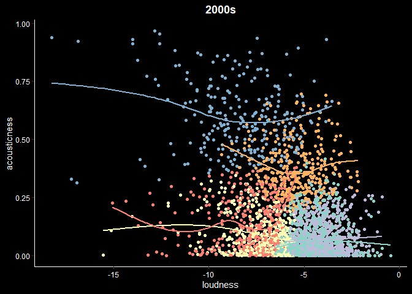<!-- -->

``` r
ggplot(songs_2010s, aes(y = acousticness, x = loudness, color = kclust_2010_scale)) +
    geom_point() +
    geom_smooth(se = FALSE) +
    scale_color_brewer(palette = "Set3") +
    labs(title = "2010s") +
    theme_classic() +
    theme(plot.background = element_rect(fill = "black", color = "black"), panel.background = element_rect(color = "black", fill = "black"), text = element_text(color = "white"), axis.text=element_text(color="white"), axis.line =element_line(color = "white"), legend.position = "none", plot.title = element_text(face = "bold", hjust = 0.5))
```

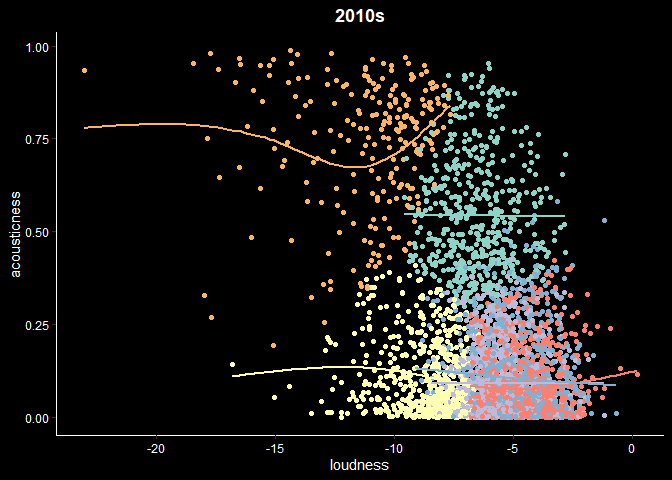<!-- -->

``` r
# loudness vs valence
ggplot(songs_2000s, aes(y = loudness, x = valence, color = kclust_2000_scale)) +
    geom_point() +
    geom_smooth(se = FALSE) +
    scale_color_brewer(palette = "Set3") +
    labs(title = "2000s") +
    theme_classic() +
    theme(plot.background = element_rect(fill = "black", color = "black"), panel.background = element_rect(color = "black", fill = "black"), text = element_text(color = "white"), axis.text=element_text(color="white"), axis.line =element_line(color = "white"), legend.position = "none", plot.title = element_text(face = "bold", hjust = 0.5))
```

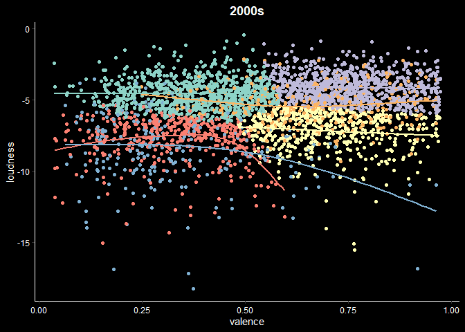<!-- -->

``` r
ggplot(songs_2010s, aes(y = loudness, x = valence, color = kclust_2010_scale)) +
    geom_point() +
    geom_smooth(se = FALSE) +
    scale_color_brewer(palette = "Set3") +
    labs(title = "2010s") +
    theme_classic() +
    theme(plot.background = element_rect(fill = "black", color = "black"), panel.background = element_rect(color = "black", fill = "black"), text = element_text(color = "white"), axis.text=element_text(color="white"), axis.line =element_line(color = "white"), legend.position = "none", plot.title = element_text(face = "bold", hjust = 0.5))
```

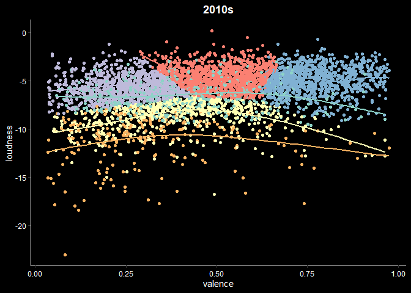<!-- -->

``` r
# valence vs acousticness
ggplot(songs_2000s, aes(y = valence, x = acousticness, color = kclust_2000_scale)) +
    geom_point() +
    geom_smooth(se = FALSE) +
    scale_color_brewer(palette = "Set3") +
    labs(title = "2000s") +
    theme_classic() +
    theme(plot.background = element_rect(fill = "black", color = "black"), panel.background = element_rect(color = "black", fill = "black"), text = element_text(color = "white"), axis.text=element_text(color="white"), axis.line =element_line(color = "white"), legend.position = "none", plot.title = element_text(face = "bold", hjust = 0.5))
```

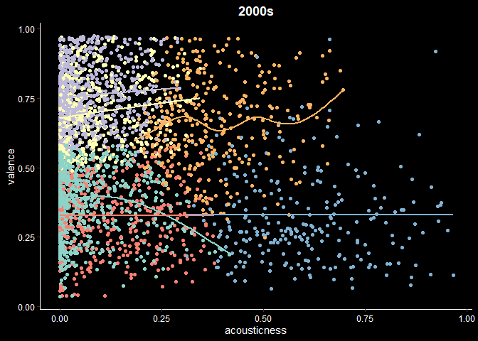<!-- -->

``` r
ggplot(songs_2010s, aes(y = valence, x = acousticness, color = kclust_2010_scale)) +
    geom_point() +
    geom_smooth(se = FALSE) +
    scale_color_brewer(palette = "Set3") +
    labs(title = "2010s") +
    theme_classic()+
    theme(plot.background = element_rect(fill = "black", color = "black"), panel.background = element_rect(color = "black", fill = "black"), text = element_text(color = "white"), axis.text=element_text(color="white"), axis.line =element_line(color = "white"), legend.position = "none", plot.title = element_text(face = "bold", hjust = 0.5))
```

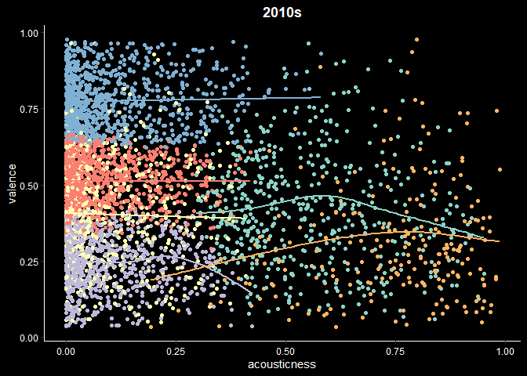<!-- -->

## Example from Popular Artists

``` r
songs_artists <- songs %>%
  filter(performer %in% c("Beyonce", "Coldplay","Taylor Swift")) %>%
  select(year, song, performer, loudness, acousticness, valence)

songs_artists %>%
  ggplot(aes(x = year, y = loudness, color = performer)) +
  geom_point(size = 2, alpha = 0.7) + 
  geom_smooth(se = FALSE) +
  geom_vline(xintercept = 2010, color = "white", linetype = "dashed") +
  geom_hline(yintercept = -10, color = "white", linetype = "dotdash") +
  scale_color_manual(values = c("pink", "#FDE725", "#1F968B")) +
  theme_classic() +
  theme(plot.background = element_rect(fill = "black", color = "black"), panel.background = element_rect(color = "black", fill = "black"), legend.background = element_rect(color = "black", fill = "black"), text = element_text(color = "white"), axis.text=element_text(color="white"), axis.line =element_line(color = "white"), plot.title = element_text(size = 14, face = "bold", hjust = 0.5))
```

<!-- -->

``` r
songs_artists %>%
  ggplot(aes(x = year, y = acousticness, color = performer)) +
  geom_point(size = 2, alpha = 0.7) + 
  geom_vline(xintercept = 2010, color = "white", linetype = "dashed") +
  geom_hline(yintercept = 0.5, color = "white", linetype = "dotdash") +
  scale_color_manual(values = c("pink", "#FDE725", "#1F968B")) +
  theme_classic() +
  theme(plot.background = element_rect(fill = "black", color = "black"), panel.background = element_rect(color = "black", fill = "black"), legend.background = element_rect(color = "black", fill = "black"), text = element_text(color = "white"), axis.text=element_text(color="white"), axis.line =element_line(color = "white"), plot.title = element_text(size = 14, face = "bold", hjust = 0.5))
```

<!-- -->

``` r
songs_artists %>%
  ggplot(aes(x = year, y = valence, color = performer)) +
  geom_point(size = 2, alpha = 0.7) + 
  geom_smooth(se = FALSE) +
  geom_vline(xintercept = 2010, color = "white", linetype = "dashed") +
  geom_hline(yintercept = 0.5, color = "white", linetype = "dotdash") +
  scale_color_manual(values = c("pink", "#FDE725", "#1F968B")) +
  theme_classic() +
  theme(plot.background = element_rect(fill = "black", color = "black"), panel.background = element_rect(color = "black", fill = "black"), legend.background = element_rect(color = "black", fill = "black"), text = element_text(color = "white"), axis.text=element_text(color="white"), axis.line =element_line(color = "white"), plot.title = element_text(size = 14, face = "bold", hjust = 0.5))
```

<!-- -->
